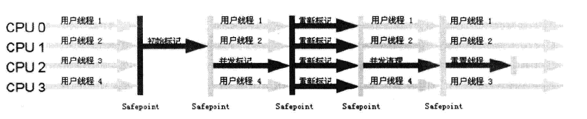
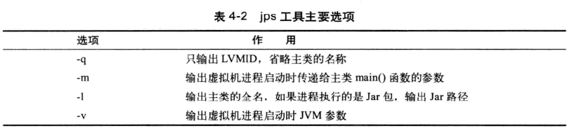
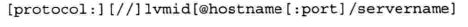

### 1.JVM内存结构


#### **程序计数器**

程序计数器是一块较小的内存空间，它的作用可以看做是当前线程所执行的字节码的行号指示器。

如果线程执行的是一个java方法，这个计数器记录的是正在执行的虚拟机字节码指令的地址；如果正在执行的是Natvie方法,计数器的值为空（undefined）

此内存区域是唯一一个在Java 虚拟机规范中没有规定任何OutOfMemoryError 情况的区域

#### **JAVA栈（java虚拟机栈、方法栈**）

每一个线程都会有一个私有的栈，因此它的**生命周期和线程相同**。每个线程中方法的调用又会在本栈中创建一个栈帧。

**栈帧**用于存储**局部变量表**、操作栈、动态链接、方法出口等信息。每一个方法被调用直到执行的完成的过程，就对应一个栈帧从虚拟机栈中从入栈到出栈的过程

**局部变量表**中存放编译期可知的各种**基本数据类型**（boolean、byte、char、short、int、float、long、double）、**对象引用**（reference 类型，它不等同于对象本身。根据不同的虚拟机实现，可能是指向对象起始地址的引用指针，也可能指向一个代表对象的句柄或者其他与此对象相关的位置）和**returnAdress类型**（执行一条字节码指令的地址）

64位长度的long和double类型的数据占用两个局部变量空间（Slot），其余的数据类型只占用一个。**局部变量表所需的内存空间在编译期间完成分配**，当进入一个方法时，这个方法需要在帧中分配多大的局部变量空间是完全确定的，在方法运行期间不会改变局部变量表的大小

异常情况：StackOverflowError： 异常线程请求的栈深度大于虚拟机所允许的深度时抛出；OutOfMemoryError 异常： 虚拟机栈可以动态扩展，当扩展时无法申请到足够的内存时会抛出。

#### **本地方法栈**

和虚拟机栈的作用十分相似，区别在于**虚拟机栈执行Java方法**，本**地方法栈是为虚拟机使用到的Native方法服务。**

与虚拟机栈一样，本地方法栈区域也会抛出StackOverflowError 和OutOfMemoryError

异常。

#### Java堆

java堆（Java Heap）是Java虚拟机所管理的内存中最大的一块，**被所有线程共享的一块区域**。**在虚拟机启动时创建**，目的是**存放对象实例**。

从结构上来分，可以分为新生代和老年代，细致点还可以分为Eden 空间、From Survivor 空间（s0）、To Survivor 空间（s1）。

Java堆是垃圾收集器管理的主要区域。如果在堆中没有内存完成实例分配，并且堆也无法再扩展时，将会抛出OutOfMemoryError 异常

#### 方法区

方法区（Method Area）与Java 堆一样，是各个线程共享的内存区域。它**用于存储已被虚拟机加载的类信息、常量、静态变量、即时编译器编译后的代码等数据**。虽然Java 虚拟机规范把方法区描述为堆的一个逻辑部分，但是它却有一个别名叫做Non-Heap（非堆），目的应该是与Java 堆区分开来。

很多人愿意把方法区称为“永久代”（Permanent Generation），本质上两者并不等价，仅仅是因为HotSpot虚拟机的设计团队选择把GC 分代收集扩展至方法区，或者说使用永久代来实现方法区而已。对于其他虚拟机（如BEA JRockit、IBM J9 等）来说是不存在永久代的概念的。在Java8中永生代彻底消失了。

对此区域会涉及但是很少进行垃圾回收。这个区域的内存回收目标主要是针对常量池的回收和对类型的卸载，一般来说这个区域的回收“成绩”比较难以令人满意。

 当方法区无法满足内存分配需求时，将抛出OutOfMemoryError。

* 运行时常量池（Runtime Constant Pool）

  这是方法区的一部分，**用于存放编译器生成的各种字面量和符号引用**，这部分将在类加载后存放到方法区的运行时的常量池中。
  


​    
​    

### 2.垃圾收集器

#### 垃圾收集算法

* 标记-清除算法

  首先标记所有需要回收的对象，在标记完成后统一回收所有被标记的对象

  

  * 缺点：标记和清除效率都不高且标记清除后会产生大量不连续的内存碎片
  
* 复制算法

  为了解决效率问题，复制（Copying）算法出现了。它将可用内存按容量大小分成两块，每次只使用其中的一块，当使用的内存用完了，就将**活着的对象复制**到另一块上面，然后把内存用完的那块空间全部清除。

  

  此算法主要用来回收新生代，新生代中将内存分为一块比较大Eden空间和两块较小的survior空间（from、to）每次使用Eden和form空间，将这两块空间还存活的对象复制到to中，最后清理掉Eden和from的空间。

  

* 标记-整理算法

  标记-整理算法主要用于老年代，让所有存货对象都向一端移动，然后直接清理掉端边界以外的内存

  


* 分代收集算法

  根据对象不同的存活周期将内存划分为几块，根据各个年代不同的特点采用最合适的手机算法


#### 垃圾收集器

垃圾收集器是内存回收的具体实现，不同的厂商、不同的版本的虚拟机提供的垃圾收集器都可能有很大的差别。学习的是SunHotSpot


* Serial收集器

  Serial收集器是最基本、历史最悠久的收集器，它是**单线程**的收集器。在进行垃圾收集时，必须暂停其他的所有工作线程，直到它收集结束


Client模式下默认的新生代收集器，与其他单线程收集器相比，Serial**简单高效**


* ParNew收集器

  ParNew收集器是Serial收集的多线程版本，使用多线程进行垃圾收集

  


运行在Server模式下的虚拟机首选的新生代收集器


* Parallel Scavenge收集器

Parallel Scavenge收集器也是一个新生代收集器，使用复制算法，**并行的多线程收集器**。

Parallel Scavenge的**目的是达到一个可控制的吞吐量**。停顿时间时间越短越适合需要与用户交互的程序，良好的响应速度能提升用户的体验，而高吞吐量可以最高效率地利用CPU时间，尽快完成程序的运算任务，只要适合在后台运算而不需要太多交互的任务。

可以用下面两个参数进行精确控制：

​        -XX:MaxGCPauseMills  设置最大垃圾收集停顿时间

　　-XX:GCTimeRatio 设置吞吐量大小

* Serial Old收集器

Serial Old 是Serial收集器的老年代版本，**单线程收集器，使用“标记-整理”算法**。


* Parallel Old 收集器

  Parallel Old是Parallel Scavenge收集器的老年代版本，使用**多线程和“标记-整理”算法**，


​     能和新生代收集器 Parallel Scavenge 配置使用，获得吞吐量最大化的效果


* CMS收集器

  CMS（Concurrent Mark Sweep）收集器是一种**以获取最短回收停顿时间为目标的收集器**。采用**标记-清除**算法。另外也将这个收集器称为**并发低延迟**收集器（Concurrent Low Pause Collector）

  

  * 整个算法过程分为如下 4 步：

  　　一、初始标记（CMS initial mark）：只是仅仅标记GC Root 能够直接关联的对象，速度很快，但是需要“Stop The World”　　

  　　二、并发标记（CMS concurrent mark）：进行GC Root Tracing的过程，简单来说就是遍历Initial Marking阶段标记出来的存活对象，然后继续递归标记这些对象可达的对象。

  　　三、重新标记（CMS Remark）：修正并发标记期间，因用户程序继续运行而导致标记产生变动的那一部分对象的标记记录，需要“Stop The World”。这个时间一般比初始标记长，但是远比并发标记时间短。

  　　四、并发清除（CMS concurrent sweep）：对上一步标记的对象进行清除操作。

  缺点：
  
  * **CMS收集器对CPU资源非常敏感。**其实，面向并发设计的程序都对CPU资源比较敏感。在并发阶段，它虽然不会导致用户线程停顿，但是会因为占用了一部分线程（或者说CPU资源）而导致应用程序变慢，总吞吐量会降低。CMS默认启动的回收线程数是（CPU数量+3）/4。
  * **CMS收集器无法处理浮动垃圾(Floating Garbage)，可能出现“Concurrent Mode Failure”失败而导致另一次Full GC的产生。**要是CMS运行期间预留的内存无法满足程序需要，就会出现一次“Concurrent Mode Failure”失败，这时虚拟机将启动后备预案：临时启用Serial Old收集器来重新进行老年代的垃圾收集，这样停顿时间就很长了。所以说参数-XX：CM SInitiatingOccupancyFraction设置得太高很容易导致大量“Concurrent Mode Failure”失败，性能反而降低
  * **CMS是一款基于“标记—清除”算法实现的收集器，这意味着收集结束时会有大量空间碎片产生**


* G1收集器

  G1（Garbage First）收集器是当前收集器技术发展的最前沿成果。G1收集器基于**“标记-整理”算法**，**可以精确的控制停顿时间**，能让使用者明确指定一个长度为M毫秒的时间片内，消耗在垃圾回收上的时间不超过 N 毫秒

  它作用于全区域。将整个Java堆划分为多个大小固定的独立区域（Regin），并且跟踪这些区域的垃圾堆积面积，在后台维护一个优先级列表，每次根据允许的收集时间，优先回收垃圾最多的区域，这样保证了G1收集器在有限的时间内可以获得最高的收集效率


* 垃圾收集相关常用参数

  


### 3.虚拟机性能监控


#### JDK自带工具

* jps：虚拟机进程状况工具

  

  



* jstat：虚拟机统计信息监视工具

  用于监视虚拟机各种状态信息的命令。可以显示本地或者远程虚拟机进程中的类装载、内存、垃圾收集、JIT编译等运行数据。

  

  如果是远程虚拟机进程，VMID格式是：

  

  


* jinfo：JAVA配置信息工具

  实时地查看和调整虚拟机的各项参数

* jmap:Java内存映像工具

  用于生产转储快照，还可以查询finalize执行队列、JAVA堆和永久代的详细信息。


* jhat：虚拟机堆转储快照分析工具

  分析jmap生成的堆转储快照

* jstack：java堆栈跟踪工具

  生成虚拟机当前时刻的线程快照。定位线程出现长时间停顿的原因


#### JDK可视化工具

* Jconsole：Java监视与管理控制台
* VisualVm


### 4.Class类文件结构

#### 概述

Class文件是由8个字节为基础的字节流构成的，这些字节流之间都严格按照规定的顺序排列，并且字节之间不存在任何空隙。当遇到需要占用8位字节以上空间的数据项时，会按照高位在前的方式分割成若干个8位字节进行存储。


#### Class文件组成

Class文件结构采用类似C语言的结构体来存储数据的，主要有两类数据项，**无符号数和表**，无符号数用来**表述数字，索引引用、数量值以及字符串**等，比如 u1，u2，u4，u8分别代表1个字节，2个字节，4个字节，8个字节的无符号数，而**表是有多个无符号数以及其它的表组成的复合结构**，习惯地以_info结尾。表用于描述有层次关系的符合结构的数据，整个Class文件本质上就是一张表。

```c
ClassFile {
    u4             magic;
    u2             minor_version;
    u2             major_version;
    u2             constant_pool_count;
    cp_info        constant_pool[constant_pool_count-1];
    u2             access_flags;
    u2             this_class;
    u2             super_class;
    u2             interfaces_count;
    u2             interfaces[interfaces_count];
    u2             fields_count;
    field_info     fields[fields_count];
    u2             methods_count;
    method_info    methods[methods_count];
    u2             attributes_count;
    attribute_info attributes[attributes_count];
}
```

* 魔数和Class文件的版本

  每个 Class 文件的头 4 个字节称为魔数（magic），它的唯一作用是判断该文件是否为一个能被虚拟机接受的 Class 文件。它的**值固定为 0xCAFEBABE**。**紧接着 magic 的 4 个字节存储的是 Class 文件的次版本号（minor_version）和主版本号（major_version）**，高版本的 JDK 能向下兼容低版本的 Class 文件，但不能运行更高版本的 Class 文件

  

* 常量池

  紧接着主次版本号之后的是常量池入口，常量池可以理解为Class文件之中的资源仓库，它是Class文件结构中与其他项目关联最多的数据类型，也是占用Class文件空间最大的数据项目之一

  