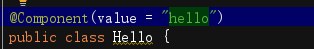
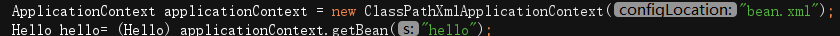
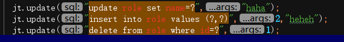

#### 1.ApplicationContext的三个常用实现类
* ClassPathXmlApplicationContext：
 在类加载路径下的配置文件，要求配置文件必须在类路径下

```
ApplicationContext ac =new ClassPathXmlApplicationContext（"xml配置文件"）

```

* FileSystemXmlApplicationContext：
 加载磁盘下任意配置文件（有访问权限）

```
ApplicationContext ac =new ClassPathXmlApplicationContext（"路径\\xml配置文件"）
```

* AnnotationConfigApplicationContext:
  
  读取注解创建容器
#### 2.两个容器接口区别
* ApplicationContext在构建容器时，采用立即加载方式，读取完配置文件马上创建配置文件中的对象，适用**单例模式**，但此接口可根据对象决定是否立即加载
   * **bean 配置scpoe属性指定bean的作用范围**
       * singleton:单例
       * prototype:多例
       * request：web应用的请求范围
       * session：web应用的会话范围
       * global-session：集群环境的会话范围，不是集群环境，为session的会话范围
* BeanFactory采用延迟加载的方式，对象需要使用才加载，适用**多例模式**

#### 3.创建bean的三种方式
##### 3.1 使用默认构造函数

```
<bean
id="demoService" class="com.xjm.service.demoServiceImpl">
</bean>
```
##### 3.2 使用普通工厂（其他类）创建bean

```
//先加载普通类
<bean id ="demoFactory" class="com.xjm.demoFactory"></bean>
<bean id ="demoService" factory-bean="demoFactory" factory-method="getdemoService"></bean>
```
##### 3.3 使用普通工厂（其他类）静态方法

```
<bean id="demoFactory" class="com.xjm.staticFactory"factory-method="getdemoService"></bean> 
```
#### 4.Spring中的依赖注入
* Spring中依赖关系由Spring来维护，依赖注入可以理解为依赖关系的维护注入

     * 使用<constructor-arg>标签
        * index: 指定参数在构造函数参数列表的索引位置
        * type: 指定参数在构造函数中的数据类型
        * name: 指定参数在构造函数中的变量名,最常用的属性
        * value: 给基本数据类型和String类型赋值
        * ref: 给其它Bean类型的字段赋值,ref属性的值应为配置文件中配置的Bean的id

```
public class People{
    private String name;
    private Integer age;
    private Date birthday;
}
public People(String name, Integer age, Date birthday) {
        this.name = name;
        this.age = age;
        this.birthday = birthday;
    }
    public void setName(String name) {
		this.name = name;
	}
	public void setAge(Integer age) {
		this.age = age;
	}
	public void setBirthday(Date birthday) {
		this.birthday = birthday;
	}

--------------
//注入
<bean id="now" class="java.util.Date" scope="prototype"></bean>

<bean id="People" class="cn.xjm.People">
	<constructor-arg name="name" value="myname"></constructor-arg>
	<constructor-arg name="age" value="18"></constructor-arg>
	<!-- birthday字段为已经注册的bean对象,其id为now -->
	<constructor-arg name="birthday" ref="now"></constructor-arg>
</bean>

```
4.2 使用set方法注入

```
<!-- 使用Date类的无参构造函数创建Date对象 -->
<bean id="now" class="java.util.Date" scope="prototype"></bean>

<bean id="accountService" class="cn.maoritian.service.impl.AccountServiceImpl">
	<property name="name" value="myname"></property>
	<property name="age" value="21"></property>
	<!-- birthday字段为已经注册的bean对象,其id为now -->
	<property name="birthday" ref="now"></property>
</bean>

```
##### 4.3集合对象的注入
，采用set方法
 * 数组字段: <array>标签表示集合,<value>标签表示集合内的成员
 * List字段: <list>标签表示集合,<value>标签表示集合内的成员.
 * Set字段: <set>标签表示集合,<value>标签表示集合内的成员
 * Map字段: <map>标签表示集合,<entry>标签表示集合内的键值对,其key属性表示键,value属性表示值
 * Properties字段: <props>标签表示集合,<prop>标签表示键值对,其key属性表示键,标签内的内容表示值.


#### 5. 注解的依赖注入

##### 5.1 创建对象(@Component)

Component将类加载进入容器，相当于`bean.xml`中的`<bean>`标签

* 属性：value：用于指定当前类的id. 不写时**默认值是当前类名,且首字母改小写**

* 首先要在xml配置文件中开启注解扫描,t添加扫描的包

  

* @Component 添加在类名上



* 创建对象

  

* 注意：以下三个注解和Component作用一样的，但一般用于三层架构

  @Controller：表现层

  @Service：业务层

  @Repository：持久层

##### 5.2 注入数据

* `@Autowired`: 自动按照成员变量类型注入
  
  * 注入过程
    * 当spring容器中有且只有一个对象的类型与要注入的类型相同时,注入该对象
    * 当spring容器中有多个对象类型与要注入的类型相同时,使用要注入的变量名作为bean的`id`,在spring 容器查找,找到则注入该对象.找不到则报错.
  * 出现位置: 既可以在变量上,也可以在方法上
  
* `@Qualifier`: 和@Autowired一起使用在自动按照类型注入的基础之上,再按照bean的`id`注入

  * 属性: 
    * value:指定bean 的id
  * 位置：可以在变量上,也可以在方法上

* `@Resource`: 直接按照bean的`id`注入，相当于同时使用`@Autowired`和`@Qualifier`两个注解

  * 属性：
    * name：指定bean的`id`

  以上的三个注解无法支持java基本类型的注入和String类型

* `@Value`: 注入基本数据类型和String类型数据

  * 属性：
    * value： 用于指定数据的值,可以使用el表达式(`${表达式}`)


##### 5.3改变作用范围和生命周期相关的注解

注解的作用相当于`bean.xml`中的`<bean>`标签的`scope`属性

* `@Scope`: 指定bean的作用范围

  * 属性：

    * value： 用于指定作用范围的取值，“singleton”、“prototype“、“session”、“globalsession”
    

作用相当于bean.xml中的<bean>标签的init-method和destroy-method属性

* `@PostConstruct`: 用于指定初始化方法
* `@PreDestroy`: 用于指定销毁方法


#### 6.纯注解配置下的注解

* `@Configuration`: 用于指定当前类是一个spring配置类,当创建容器时会从该类上加载注解.获取容器时需要使用`AnnotationApplicationContext(有@Configuration注解的类.class)`
* `@ComponentScan`: 指定spring在初始化容器时要扫描的包,作用和`bean.xml` 文件中`<context:component-scan base-package="要扫描的包名"/>`是一样的
* `@Bean`: 该注解只能写在方法上,表明使用此方法创建一个对象,并放入spring容器
  * 属性name：指定此方法创建出的bean对象的`id`
  * 细节: 使用注解配置方法时,如果方法有参数,Spring框架会到容器中查找有没有可用的bean对象,查找的方式与`@Autowired`注解时一样的
* `@PropertySource`: 用于加载properties配置文件中的配置.例如配置数据源时,可以把连接数据库的信息写到properties配置文件中,就可以使用此注解指定properties配置文件的位置,其属性如下:
  * `value`: 用于指定properties文件位置.如果是在类路径下,需要写上`"classpath:"`
* `@Import`: 用于导入其他配置类.当我们使用`@Import`注解之后,有`@Import`注解的类就是父配置类,而导入的都是子配置类. 其属性如下:
  * `value`: 用于指定其他配置类的字节码


#### 7.JdbcTemplate

##### 7.1 环境配置

* 导入相关依赖

  ```xml
  <dependency>
        <groupId>org.springframework</groupId>
        <artifactId>spring-jdbc</artifactId>
        <version>5.1.9.RELEASE</version>
      </dependency>
      <dependency>
        <groupId>org.springframework</groupId>
        <artifactId>spring-tx</artifactId>
        <version>5.1.9.RELEASE</version>
      </dependency>
      <dependency>
        <groupId>mysql</groupId>
        <artifactId>mysql-connector-java</artifactId>
        <version>5.1.6</version>
      </dependency>
  ```

* 在xml配置文件中配置数据源和JdbcTemplate对象

```xml
    <!-- 配置jdbcTemplate -->
    <bean id="jdbcTemplate" class="org.springframework.jdbc.core.JdbcTemplate">
        <property name="dataSource" ref="dataSource"></property>
    </bean>
    <!-- 配置数据源   -->
    <bean id="dataSource" class="org.springframework.jdbc.datasource.DriverManagerDataSource">
        <property name="driverClassName" value="com.mysql.jdbc.Driver"></property>
        <property name="url" value="jdbc:mysql://localhost:3306/internship"></property>
        <property name="username" value="root"></property>
        <property name="password" value="123456"></property>
    </bean>
```

  ​    

* CRUD操作

  * 增加、删除、更新操作

    update("SQL语句", 参数...)

    

    也可以直接update("SQL语句")

  * 查询操作

    使用query（）方法,参数如下

    ```java
    List<Role> list=jt.query("select * from role",new BeanPropertyRowMapper<>(Role.class));
    ```

    * String sql: SQL语句
    * RowMapper<T> rowMapper`: 指定如何将查询结果`ResultSet`对象转换为`T`对象.
    * @Nullable Object... args: SQL语句的参数

​            RowMapper<T> rowMapper可以自己写一个实现类,但常用Spring框架内置的实现类`BeanPropertyRowMapper<T>(T.class)`


