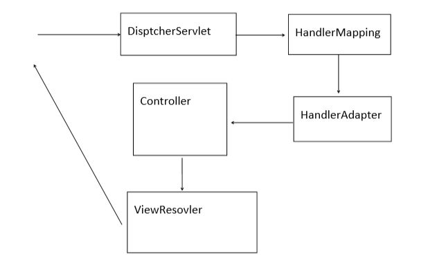
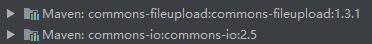
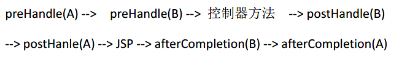

### 1.三层架构

* 表现层：  也就是我们常说的web层。它负责接收客户端请求，向客户端响应结果，通常客户端使用http协议请求 web 层，web 需要接收 http 请求，完成 http 响应。  表现层包括**展示层和控制层**：**控制层负责接收请求，展示层负责结果的展示**。   表现层的设计一般都使用 MVC 模型。（MVC 是表现层的设计模型，和其他层没有关系） 
* 业务层：  也就是我们常说的 service 层。它**负责业务逻辑处理**，web 层依赖业 务层，但是业务层不依赖 web 层。  业务层在业务处理时可能会依赖持久层。
* 持久层：  **负责数据持久化**，持久层就是和数据库交互。
### 2. MVC模型

*  MVC全名是Model View Controller 模型视图控制器，每个部分各司其职。 
*  Model：数据模型，JavaBean的类，用来进行数据封装。 
*   View：指JSP、HTML用来展示数据给用户
*   Controller：用来接收用户的请求，整个流程的控制器。用来进行数据校验等。 

### 3.SpringMVC重要组件

* DispatcherServlet: 前端控制器,接收所有请求
*  HandlerMapping: 解析请求格式的.判断希望要执行哪个具体
  的方法
* HandlerAdapter: 负责调用具体的方法.
* 4ViewResovler:视图解析器.解析结果,准备跳转到具体的物理视
  图



### 4.环境配置

3.1  Maven坐标导入相关jar包
3.2 配置核心控制器和xml配置文件导入

* dispatcherServlet 是整个流程控制的中心，由 它调用其它组件处理用户的请求，dispatcherServlet 的存在降低了组件之间的耦合性
```xml
<servlet>
    <servlet-name>dispatcherServlet</servlet-name>
    <servlet-class>org.springframework.web.servlet.DispatcherServlet</servlet-class>
    <init-param>
      <param-name>contextConfigLocation</param-name>
      <param-value>classpath:mvc.xml</param-value>
    </init-param>
    <load-on-startup>1</load-on-startup>
  </servlet>
  <servlet-mapping>
    <servlet-name>dispatcherServlet</servlet-name>
    <url-pattern>/</url-pattern>
  </servlet-mapping>
```
3.3 在Springmvc配置文件配置视图解析器

* 视图解析器负责将处理结果生成 View 视图，View Resolver 首先根据逻辑视图名解析成物理视图名 即具体的页面地址，再生成 View 视图对象，最后对 View 进行渲染将处理结果通过页面展示给用户（SpringMVC也会提供默认视图解析器）

```
<bean id="internalResourceViewResolver" class="org.springframework.web.servlet.view.InternalResourceViewResolver">
    <property name="prefix" value="/WEB-INF/views/"></property>
    <property name="suffix" value=".jsp"></property>
</bean>
```
3.4 Springmvc配置文件配置配置 <mvc:annotation-driven>

*  SpringMVC中还有HandlerMapping：处理器映射器 和 HandlAdapter：处理器适配器 两大组件
*  使用<mvc:annotation-driven> 自动加载这两大组件
```xml
<mvc:annotation-driven></mvc:annotation-driven>
```
* 也可以自行配置

  ```xml
  <!--    配置处理映射器 将映射bean加入 urlMap中-->
      <bean class="org.springframework.web.servlet.handler.SimpleUrlHandlerMapping">
          <property name="urlMap">
              <map>
                  <entry key="demo" value-ref="demoController"></entry>
              </map>
          </property>
      </bean>
  <!--    配置处理适配器-->
      <bean class="org.springframework.web.servlet.mvc.SimpleControllerHandlerAdapter">
          
         
  ```

  

* 注意：

  *  **<url-pattern> / </url-pattern>**：会匹配到 /springmvc 这样的路径型url，而不会匹配到像 .jsp 这样的后缀型的url

  * **<url-pattern> /\* </url-pattern>**：会匹配到所有的url：路径型url 和后缀型的url （包括/springmvc,.jsp,.js,和.html等）

  所以需要添加静态资源扫描路径：

  ```xml
  <mvc:resources location="/js/" mapping="/js/**"</mvc:resources> 
  <mvc:resources location="/css/" mapping="/css/**"></mvc:resources>
  <mvc:resources location="/images/"mapping="/images/**"</mvc:resources> 
  ```

  

### 5. RequestMapping注解

4.1 RequestMapping的属性
* value：用于指定请求的 URL。它和 path 属性的作用是一样的.如下默认为value
```java
@RequestMapping("melist")
```
* method：用于指定请求的方式。
* params：用于指定限制请求参数的条件。它支持简单的表达式。要求请求参数的 key 和 value 必须和 配置的一模一样。

*  headers ：发送的请求中必须包含的请求头

4.2 RequestMapping注解可以作用在方法和类上
*  作用在类上：第一级的访问目录 
*  作用在方法上：第二级的访问目录

### 6.请求参数的绑定

6.1 表单提交name和参数名称一致（区分大小写）

```java
<a href="account/findAccount?accountId=10&accountName=zhangsan">

@RequestMapping("/findAccount") 
public String findAccount(Integer accountId,String accountName) 
```
6.2 表单提交name和pojo类中的属性参数一致可直接使用pojo类型接受数据

```java
@RequestMapping("/saveUser") 
public String saveAccount(User user)
```
6.3 如果一个pojo类中包含其他的引用类型，那么表单的name属性需要编写成：对象.属性 例如： address.name 


6.4 pojo类中包含集合属性的话，表单的name属性要编写成 集合名[?].属性，例如：

```java
private List<Account> accounts; 
//表单描写：
<input type="text" name="accounts[0].name" ><br/>  
<input type="text" name="accounts[0].money" ><br/> 

```
6.5 表单名和方法参数名称不一致以及多个同名参数时使用@RequestParam

```java
public String testDemo(@RequestParam(name = "name2") String name,@RequestParam(name = "name3") int age)｛｝
//设置默认值
public String testDemo2(@RequestParam(defaultValue = "2") String name,@RequestParam(defaultValue ="2") int age)
//设置属性必须要有值
public String testDemo2(@RequestParam(required = true) String name,@RequestParam(defaultValue ="2") int age)
 //多个同名参数获取
    <input type="chebox" name="name" value="xm">
    <input type="chebox" name="name" value="xh">
public String testDemo2(@RequestParam(name="name") List<String> name,@RequestParam(name="") int age)
```

6.6.restful传值风格

```java
//url
<a href="/demo/222/aaaa">跳转</a>

 @RequestMapping("demo/{id}/{name}")
    public String testRestful(@PathVariable int id,@PathVariable("name")String name2){
        System.out.println(id+name2);
        return "/index";
    }
```

* 在@RequestMapping 中一定要和请求格式对应,{XX} 中名称自定义名称
* @PathVariable 获取@RequestMapping 中内容,默认按照方法参数名称查找，名称不一致加上@RequestMapping的参数名

### 7.响应数据

7.1 String<br>
返回字符串可以指定逻辑视图的名称，根据视图解析器为物理视图的地址，如下返回successs.jsp页面

```java
@RequestMapping("/hello")
    public String hello(){
        System.out.println("hello");
        return "successs";
    }
```
7.2 void 

* 系统自动返回当前路径名的同名JSP相关文件
* 可以在里面作重定向或者请求转发,地址不要带有相应的jsp结尾，会找不到对应文件，可以转发有控制器处理的地址
  
```java
//重定向
    @RequestMapping("/returnVoid")
    public void returnVoid(HttpServletRequest request,HttpServletResponse response) throws IOException {
      response.sendRedirect("hello");
//将地址转发到hello，该控制函数再跳转到相对页面
request.getRequestDispatcher("hello").forward(request,response);
    }
```
* 返回值是ModelAndView对象

```java
public ModelAndView returnMAV(){
        ModelAndView mv=new ModelAndView();
        mv.addObject("user","haha");
        mv.addObject("age",1);
        mv.setViewName("successs");
        return mv;
    }
    //前端获取相对应的值
    ${requestScope.user}
  ${requestScope.age}
```
* 在控制器中请求转发的另一种写法:
转发写JSP文件路径可以打开网页，重定向不行，要写地址，根据控制器去转发页面
```java
 @RequestMapping("/hello")
    public String hello(){
        System.out.println("hello");
//        return "successs";
//        正确写法
//    return "forward:WEB-INF/view/successs.jsp";
//  错误写法 return "forward:WEB-INF/view/successs";
   return "redirect:returnMAV";
        }
```

7.3 @ResponseBody

*  在方法上只有@RequestMapping 时,无论方法返回值是什么认为需
  要跳转

* 在方法上添加@ResponseBody(恒不跳转)

  * 如果返回值满足 key-value 形式(对象或 map)

    * 把响应头设置为 application/json;charset=utf-8,
    * 把转换后的内容输出流的形式响应给客户端.

  * 如果返回值不满足 key-value,例如返回值为 String

    * 把相应头设置为 text/html

    *  把方法返回值以流的形式直接输出.

    *  如果返回值包含中文,出现中文乱码

      * 1produces 表示响应头中 Content-Type 取值

      ```java
      @RequestMapping(value="demo",produces="text/html; charset=utf-8")
      ```


### 8.作用域传值的几种方式

##### 8.1 原生Servelet传递

*  在处理方法的参数添加作用域对象

```java
/**
     * 原生Servlet传递
     * @param request
     * @return
     */
    @RequestMapping("req")
    public String hello(HttpServletRequest request){
        request.setAttribute("req","我是req");
        request.getSession().setAttribute("session","我是session");
        return "index";
    }
```

  ##### 8.2 map集合传递

* Spring会对map集合BindingAwareModelMap进行实例化

* 把map的内容放在request作用域中

  ```java
  /**
       * map传值
       * @param map
       * @return
       */
      @RequestMapping("map")
      public String map(Map<String,Object> map){
          map.put("map","map的值");
          return "index";
      }
  ```


##### 8.3 SpringMVC的Model接口对象传值

* 使用该接口最终内容是在request作用域中

  ```java
   /**
       * Model传值
       * @param model
       * @return
       */
      @RequestMapping("model")
      public String model(Model model){
          model.addAttribute("model","model的值");
          return "index";
      }
  ```


##### 8.4 使用SpringMVC的ModelAndView接口传值

* 该接口还可以设置跳转视图

  ```java
  /**
       * ModelAndView传递值
       * @return
       */
      @RequestMapping("mav")
      public ModelAndView mav(){
          ModelAndView mav=new ModelAndView("index");
          mav.addObject("mav","ModelAndView传递的值");
          return mav;
      }
  ```


### 9.Spring文件的下载和上传

#### 9.1 文件下载

* 请求的响应头应该设置Content-Disposition为attchment；filename=文件名

  * 浏览器默认inline：资源能打开显示就显示，无法显示则下载
  * filename为下载时显示的下载文件名

* 实现步骤：

  * 需要依赖commons两个jar包

    

  * 设置响应头

    ```java
    response.setHeader("Content-Disposition","attachment;filename=文件名");
    ```

  * 以二进制流文件传输给客户端

    ```java
    //        传输文件
            ServletOutputStream outputStream=response.getOutputStream();
            String path ="D:\\train_group2\\SsmDemo\\src\\main\\resources\\files";
            File file=new File(path,fileName);
            byte[]bytes= FileUtils.readFileToByteArray(file);
            outputStream.write(bytes);
            outputStream.flush();
            outputStream.close();
        }
    ```

    

#### 9.2 文件上传

* 在<form>中的enctype模式值是application/x-www-form-urlencoded，（少量文字信息）

  **text/plain**:大文字量使用的类型

  **multipart/form-data**：表单中包含二进制文件内容

* 实现步骤:

  * 表单设置enctype值，同时method设置为post

    ```jsp
    <form action="upload" enctype="multipart/form-data" method="post">
        <input type="file" name="fileName">
        <input type="submit" value="提交">
    </form>
    ```

  * 通过MutilpartFile封装类获取文件流，配置此bean

    ```xml
     <bean id="multipartResolver" class="org.springframework.web.multipart.commons.CommonsMultipartResolver">
         //设置最大上传文件大小
            <property name="maxUploadSize" value="1000">
         </property>
        </bean>
    ```

  * 在控制器获取相应文件

    ```java
     @RequestMapping("upload")
        public String upLoad(MultipartFile file) throws IOException {
            String fileName=file.getOriginalFilename();
            String suffix=fileName.substring(fileName.lastIndexOf("."));
            String newFile= UUID.randomUUID().toString()+suffix;
            file.transferTo(new File("E://",newFile));
            return "index";
        }
    ```

    

   
### 10.自定义拦截器

  ####  作用范围：

    发送**请求**通过控制器方法时进行拦截（Controller)。

#### 实现步骤:

* 类实现Handler Intercepter

  ```java
  public class DemoIntercept implements HandlerInterceptor {
    /*
    * 在进入控制器方法前执行
    * */
      @Override
      public boolean preHandle(HttpServletRequest request, HttpServletResponse response, Object handler) throws Exception {
          System.out.println("preHandle");
          return true;
      }
  /*
  * 在控制器方法执行后进入jsp页面前执行
  * */
      @Override
      public void postHandle(HttpServletRequest request, HttpServletResponse response, Object handler, ModelAndView modelAndView) throws Exception {
          System.out.println("postHandle");
      }
  /*
  * 在进入jsp页面后执行，可以搜集异常信息
  * */
      @Override
      public void afterCompletion(HttpServletRequest request, HttpServletResponse response, Object handler, Exception ex) throws Exception {
       System.out.println("afterCompletion");
      }
  }
  ```

* 在Springmvc配置文件中配置拦截器需要拦截的控制器

  ```xml
  <!--    全局拦截器配置-->
      <mvc:interceptors>
          <bean class="com.xjm.intercept.DemoIntercept"></bean>
      </mvc:interceptors>
  <!--    配置单个控制器-->
  <mvc:interceptors>
      <mvc:interceptor>
          <mvc:mapping path="/mav"/>
          <bean class="com.xjm.intercept.DemoIntercept"></bean>
      </mvc:interceptor>
  </mvc:interceptors>
  
  ```

#### 拦截器栈

多个拦截器生效时就形成了拦截器栈

执行顺序与SpringMVC配置文件的拦截器顺序有关，先进后出

例如：先配置A再配置B的顺序为：




