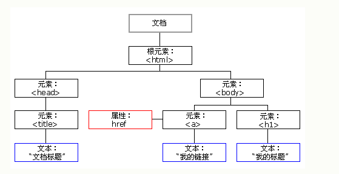

### 1.基础

#### 1.1基础语法

* JavaScript 使用 var 关键词来*声明*变量

* *字符串*是文本，由双引号或单引号包围：

* JavaScript 使用*算数运算符*（+ - * /）来*计算值*

* 双斜杠 // 或 /* 与 **/* 之间的代码被视为*注释*。

* 所有 JavaScript 标识符*对大小写敏感*

* JavaScript 使用 *Unicode* 字符集

* 如果再次声明某个 JavaScript 变量，将不会丢它的值

  ```javascript
  var name="xjm";
  var name;
  ```

* 数据类型有：**字符串值，数值，布尔值，数组，对象**

  在 JavaScript 中，没有值的变量，其值是 undefined

  ```javascriptjava
  //数组类型
  var cars = ["Porsche", "Volvo", "BMW"];
  //对象属性是 name:value 对，由逗号分隔
  var person = {firstName:"Bill", lastName:"Gates", age:62, eyeColor:"blue"};
  ```

* 函数

  JavaScript 函数通过 function 关键词进行定义，其后是*函数名*和括号 ()

  JavaScript 到达 return 语句，函数将停止执行


#### 1.2 HTML事件

* 常见的HTML事件

  | 事件        | 描述                         |
  | :---------- | :--------------------------- |
  | onchange    | HTML 元素已被改变            |
  | onclick     | 用户点击了 HTML 元素         |
  | onmouseover | 用户把鼠标移动到 HTML 元素上 |
  | onmouseout  | 用户把鼠标移开 HTML 元素     |
  | onkeydown   | 用户按下键盘按键             |
  | onload      | 浏览器已经完成页面加载       |

  javaScript可以处理这些事件

```javascript
<button onclick="window.alert(6+6)">try</button>
<button onclick="this.innerHTML=Date()">time</button>
```

#### 1.3 日期

* 日期获取方法

  | 方法              | 描述                                 |
  | :---------------- | :----------------------------------- |
  | getDate()         | 以数值返回天（1-31）                 |
  | getDay()          | 以数值获取周名（0-6）                |
  | getFullYear()     | 获取四位的年（yyyy）                 |
  | getHours()        | 获取小时（0-23）                     |
  | getMilliseconds() | 获取毫秒（0-999）                    |
  | getMinutes()      | 获取分（0-59）                       |
  | getMonth()        | 获取月（0-11）                       |
  | getSeconds()      | 获取秒（0-59）                       |
  | getTime()         | 获取时间（从 1970 年 1 月 1 日至今） |

* 日期设置方法

  | 方法              | 描述                                         |
  | :---------------- | :------------------------------------------- |
  | setDate()         | 以数值（1-31）设置日                         |
  | setFullYear()     | 设置年（可选月和日）                         |
  | setHours()        | 设置小时（0-23）                             |
  | setMilliseconds() | 设置毫秒（0-999）                            |
  | setMinutes()      | 设置分（0-59）                               |
  | setMonth()        | 设置月（0-11）                               |
  | setSeconds()      | 设置秒（0-59）                               |
  | setTime()         | 设置时间（从 1970 年 1 月 1 日至今的毫秒数） |


### 2.DOM

#### 2.1 HTML DOM

当网页被加载时，浏览器会创建页面的文档对象模型（*D*ocument *O*bject *M*odel）



通过这个对象模型，JavaScript 获得创建动态 HTML 的所有力量：

- JavaScript 能改变页面中的所有 HTML 元素
- JavaScript 能改变页面中的所有 HTML 属性
- JavaScript 能改变页面中的所有 CSS 样式
- JavaScript 能删除已有的 HTML 元素和属性
- JavaScript 能添加新的 HTML 元素和属性
- JavaScript 能对页面中所有已有的 HTML 事件作出反应
- JavaScript 能在页面中创建新的 HTML 事件


#### 2.2 document 对象来访问和操作 HTML

* 查找HTML元素

  | 方法                                    | 描述                   |
  | :-------------------------------------- | :--------------------- |
  | document.getElementById(*id*)           | 通过元素 id 来查找元素 |
  | document.getElementsByTagName(*name*)   | 通过标签名来查找元素   |
  | document.getElementsByClassName(*name*) | 通过类名来查找元素     |

* 改变HTML元素

  | 方法                                       | 描述                   |
  | :----------------------------------------- | :--------------------- |
  | element.innerHTML = *new html content*     | 改变元素的 inner HTML  |
  | element.attribute = *new value*            | 改变 HTML 元素的属性值 |
  | element.setAttribute(*attribute*, *value*) | 改变 HTML 元素的属性值 |
  | element.style.property = *new style*       | 改变 HTML 元素的样式   |

* 添加和删除元素

  | 方法                              | 描述             |
  | :-------------------------------- | :--------------- |
  | document.createElement(*element*) | 创建 HTML 元素   |
  | document.removeChild(*element*)   | 删除 HTML 元素   |
  | document.appendChild(*element*)   | 添加 HTML 元素   |
  | document.replaceChild(*element*)  | 替换 HTML 元素   |
  | document.write(*text*)            | 写入 HTML 输出流 |

* 添加鼠键处理程序

  | 方法                                                     | 描述                            |
  | :------------------------------------------------------- | :------------------------------ |
  | document.getElementById(id).onclick = function(){*code*} | 向 onclick 事件添加事件处理程序 |

* 查找HTML对象

  | 属性                         | 描述                                        | DOM  |
  | :--------------------------- | :------------------------------------------ | :--- |
  | document.anchors             | 返回拥有 name 属性的所有 <a> 元素。         | 1    |
  | document.applets             | 返回所有 <applet> 元素（HTML5 不建议使用）  | 1    |
  | document.baseURI             | 返回文档的绝对基准 URI                      | 3    |
  | document.body                | 返回 <body> 元素                            | 1    |
  | document.cookie              | 返回文档的 cookie                           | 1    |
  | document.doctype             | 返回文档的 doctype                          | 3    |
  | document.documentElement     | 返回 <html> 元素                            | 3    |
  | document.documentMode        | 返回浏览器使用的模式                        | 3    |
  | document.documentURI         | 返回文档的 URI                              | 3    |
  | document.domain              | 返回文档服务器的域名                        | 1    |
  | document.domConfig           | 废弃。返回 DOM 配置                         | 3    |
  | document.embeds              | 返回所有 <embed> 元素                       | 3    |
  | document.forms               | 返回所有 <form> 元素                        | 1    |
  | document.head                | 返回 <head> 元素                            | 3    |
  | document.images              | 返回所有  元素                         | 1    |
  | document.implementation      | 返回 DOM 实现                               | 3    |
  | document.inputEncoding       | 返回文档的编码（字符集）                    | 3    |
  | document.lastModified        | 返回文档更新的日期和时间                    | 3    |
  | document.links               | 返回拥有 href 属性的所有 <area> 和 <a> 元素 | 1    |
  | document.readyState          | 返回文档的（加载）状态                      | 3    |
  | document.referrer            | 返回引用的 URI（链接文档）                  | 1    |
  | document.scripts             | 返回所有 <script> 元素                      | 3    |
  | document.strictErrorChecking | 返回是否强制执行错误检查                    | 3    |
  | document.title               | 返回 <title> 元素                           | 1    |
  | document.URL                 | 返回文档的完整 URL                          | 1    |

* DOM事件监听器

  addEventListener() 方法为指定元素指定事件处理程序

  ```
  element.addEventListener(event, function, useCapture);
  ```

  第一个参数是事件的类型（比如 "click" 或 "mousedown"）。

  第二个参数是当事件发生时我们需要调用的函数。

  第三个参数是布尔值，指定使用事件冒泡还是事件捕获。此参数是可选的


### 3.AJAX

**Ajax 的核心是 XMLHttpRequest 对象。**

#### 3.1 XMLHTTPRequest对象

* 创建对象XMLHTTPRequest对象

  ```javascript
  var xmlhttp;
  if (window.XMLHttpRequest)
    {// code for IE7+, Firefox, Chrome, Opera, Safari
    xmlhttp=new XMLHttpRequest();
    }
  else
    {// code for IE6, IE5
    xmlhttp=new ActiveXObject("Microsoft.XMLHTTP");
    }
  ```


#### 3.2 向服务器发送请求

| 方法                         | 描述                                                         |
| :--------------------------- | :----------------------------------------------------------- |
| open(*method*,*url*,*async*) | 规定请求的类型、URL 以及是否异步处理请求。*method*：请求的类型；GET 或 POST；*url*：文件在服务器上的位置*async*：true（异步）或 false（同步） |
| send(*string*)               | 将请求发送到服务器。*string*：仅用于 POST 请求               |

如果需要像 HTML 表单那样 POST 数据，请使用 setRequestHeader() 来添加 HTTP 头

| 方法                               | 描述                                                         |
| :--------------------------------- | :----------------------------------------------------------- |
| setRequestHeader(*header*,*value*) | 向请求添加 HTTP 头。*header*: 规定头的名称*value*: 规定头的值 |

```javascript
xmlhttp.open("POST","ajax_test",true);
xmlhttp.setRequestHeader("Content-type","application/x-www-form-urlencoded");
xmlhttp.send("fname=xjm&lname=hh");
```

* ajax同步 ： 意味着此时请求Server后，JS代码不再继续执行，等待Server返回后才继续往下执行
* ajax异步 ： 意味着此时请求Server后，JS代码继续执行，不管Server什么时候返回

#### 3.3 服务器响应

* 获得来自服务器的响应，请使用 XMLHttpRequest 对象的 responseText 或 responseXML 属性。

| 属性         | 描述                       |
| :----------- | :------------------------- |
| responseText | 获得字符串形式的响应数据。 |
| responseXML  | 获得 XML 形式的响应数据。  |

* XMLHTTPRequest的属性

  | 属性               | 描述                                                         |
  | :----------------- | :----------------------------------------------------------- |
  | onreadystatechange | 存储函数（或函数名），每当 readyState 属性改变时，就会调用该函数。 |
  | readyState         | 存有 XMLHttpRequest 的状态。从 0 到 4 发生变化。0: 请求未初始化1: 服务器连接已建立2: 请求已接收3: 请求处理中4: 请求已完成，且响应已就绪 |
  | status             | 200: "OK"404: 未找到页面                                     |

  ```javascript
  xmlhttp.onreadystatechange=function()
    {
    if (xmlhttp.readyState==4 && xmlhttp.status==200)
      {
      document.getElementById("myDiv").innerHTML=xmlhttp.responseText;
      }
    }
  ```

  onreadystatechange 事件被触发 5 次（0 - 4），对应着 readyState 的每个变化