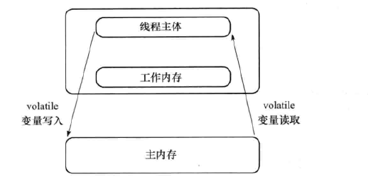
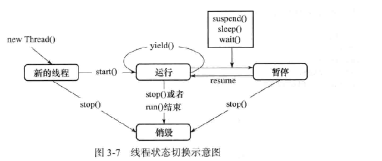

### 1.相关名词术语

* 同步和异步：同步是指：当程序1调用程序2时，程序1停下不动，直到程序2完成回到程序1来，程序1才继续执行下去。.异步是指：当程序1调用程序2时，程序1径自继续自己的下一个动作，不受程序2的的影响

* 死锁

  两个或两个以上的线程在等待不可能释放的资源，而导致剩下的任务无法完成为死锁

* 并发和并行

  并发：多个任务交替执行（看起来像同时执行）

  并行：多个任务同时执行

* 临界区

  表示公共资源或者共享数据

* 阻塞和非阻塞

  当有线程占用临界区资源，其他也需要这个临界区资源的线程也必须等待，等待会导致线程挂起，这就是阻塞。

  非阻塞与之相反，没有一个线程会妨碍其他线程的执行

* 并发级别：

  * 阻塞
  * 无饥饿
  * 无障碍：线程可以同时进入临界区，有冲突回滚操作
  * 无锁
  * 无等待

* Amdahl定律

  提升系统效率，增加CPU处理器数量加速效果也有限，还需要从根本上更改程序，提高可并行化模块


### 2.volatile关键字

#### java 内存模型中的可见性、原子性和有序性

* 可见性：

  当多个线程访问同一个变量x时，线程1修改了变量x的值，线程1、线程2...线程n能够立即读取到线程1修改后的值。

* 原子性：

  即一个操作或者多个操作 要么全部执行并且执行的过程不会被任何因素打断，要么就都不执行
  
* 有序性：
即程序执行的顺序按照代码的先后顺序执行


#### volatile的定义和基础

volatile是轻量级的synchronized，修饰在需要共享的变量上。

关键字volatile的作用是强制从公共堆栈中获得变量的值，而不是从线程私有数据栈取得变量的值，




volatile增加了实例变量在多个线程之间的可见性，但它不支持原子性

* 和synchronized比较：
  * volatile性能比synchronized好，只能修饰变量，而ssynchronized能修饰方法、代码块。
  * 多线程访问volatile不会发生阻塞，synchronized会出现阻塞
  * synchronized可以保证原子性，也可以间接保证可见性。
  * volatile解决的是**变量在线程之间的可见性**，synchronized解决的是**多个线程之间访问资源的同步性**


### 3.线程间通信

#### 等待/通知机制

* wait（）方法

  该方法能使当前执行代码的线程进行等待，为Object类的方法，在wait（）所在的代码行处停止执行。直到被通知或被中断为止

  在调用wait（）前，线程必须获得该对象级别的锁，即只能在同步代码块或者同步方法中调用该方法。没有持有相应的锁时，抛出IllegalMonitorStateException。

* notify（）方法

  该方法的使用和wait（）一样。如果有多个线程在等待，由线程规划器挑选出一个wait状态的线程，使它等待获取该对象的锁。

  notify线程不会马上释放对象锁，执行notify线程的将程序执行完（synchronized代码块）才会释放锁，切没有notify（）继续通知的话，其他还在等待该对象的锁还会继续等待。




#### 管道线程间通信

* PipedInputStream和PipeOutpuStream

  以字节流的方式将数据发送到输出管道，另一个线程可以在输出管道读取数据

* PipedReader和PipedWriter

  字符流


#### join（）方法的使用

在很多情况下，主线程生成并起动了子线程，如果子线程里要进行大量的耗时的运算，主线程往往将于子线程之前结束，但是如果主线程处理完其他的事务后，需要用到子线程的处理结果，也就是主线程需要等待子线程执行完成之后再结束，这个时候就要用到join()方法

在join过程中，如果当前线程对象被中断会出现异常

join（long）可以设置等待时间

* 在join方法内部使用wait（long）来实现的，所以具有释放锁的特点


#### ThreadLocal类

ThreadLocal主要解决的是为每个线程绑定自己的值，具有线程变量的隔离性（每个线程只能取到自己存取的值）。

* 方法：

| `T`                         | `get()`  返回当前线程的此线程局部变量的副本中的值。          |
| --------------------------- | ------------------------------------------------------------ |
| `protected T`               | `initialValue()`   返回此线程局部变量的当前线程的“初始值”。  |
| `void`                      | `remove()`  删除此线程局部变量的当前线程的值。               |
| `void`                      | `set(T value)`  将当前线程的此线程局部变量的副本设置为指定的值。 |
| `static <S> ThreadLocal<S>` | `withInitial(Supplier<? extends  S> supplier)`  创建线程局部变量。 |


#### InheritableThreadLocal

使用InheritableThreadLocal可以在子线程中取得父线程继承下来的值

该类扩展了`ThreadLocal`以提供从父线程到子线程的值的继承：当子线程被创建时，子接收到父值具有值的所有可继承的线程局部变量的初始值。  孩子的价值通常与父母的价值相同;  然而，通过`childValue`方法，孩子的价值可以成为父母的任意功能


### 4.Lock的使用

#### 锁的相关概念

* 可重入性锁

  如果锁具备可重入性，则称作为可重入锁。例如当一个线程执行到某个synchronized方法时，比如说method1，而在method1中会调用另外一个synchronized方法method2，此时线程不必重新去申请锁，而是可以直接执行方法method2。

* 可中断锁

  在Java中，synchronized就不是可中断锁，而Lock是可中断锁。

  如果某一线程A正在执行锁中的代码，另一线程B正在等待获取该锁，可能由于等待时间过长，线程B不想等待了，想先处理其他事情，我们可以让它中断自己或者在别的线程中中断它，这种就是可中断锁。

* 公平锁

  公平锁即尽量以请求锁的顺序来获取锁。比如同是有多个线程在等待一个锁，当这个锁被释放时，等待时间最久的线程（最先请求的线程）会获得该所，这种就是公平锁

  非公平锁即无法保证锁的获取是按照请求锁的顺序进行的。这样就可能导致某个或者一些线程永远获取不到锁

  synchronized就是非公平锁，它无法保证等待的线程获取锁的顺序.对于ReentrantLock和ReentrantReadWriteLock，它默认情况下是非公平锁，但是可以设置为公平锁

#### ReentrantLock

Lock`实现提供比使用`synchronized`方法和语句可以获得的更广泛的锁定操作。  它们允许更灵活的结构化，可能具有完全不同的属性，并且可以支持多个相关联的对象Condition

Lock是一个接口

| Modifier and Type | Method and Description                                       |
| ----------------- | ------------------------------------------------------------ |
| `void`            | `lock()`   获得锁。                                          |
| `void`            | `lockInterruptibly()`  获取某个锁时，如果不能获取到，只有进行等待的情况下，是可以响应中断的。 |
| `Condition`       | `newCondition()`   返回一个新Condition绑定到该实例`Lock`实例。 |
| `boolean`         | `tryLock()`  尝试获取锁                                      |
| `boolean`         | `tryLock(long time,  TimeUnit unit)`  在拿不到锁时会等待一定的时间，在时间期限之内如果还拿不到锁，就返回false。 |
| `void`            | `unlock()`   释放锁。                                        |


ReentrantLock是唯一实现了Lock接口的类，并且ReentrantLock提供了更多的方法。

* Lock的使用示例

```java
 Lock lock = new ReentrantLock();    //注意这个地方
        lock.lock();
        try {
            System.out.println(thread.getName()+"得到了锁");
            for(int i=0;i<5;i++) {
                arrayList.add(i);
            }
        } catch (Exception e) {
            // TODO: handle exception
        }finally {
            System.out.println(thread.getName()+"释放了锁");
            lock.unlock();
       }
    }
```

* 新增方法

   | Modifier and Type              | Method and Description                                       |
   | ------------------------------ | ------------------------------------------------------------ |
   | `int`                          | `getHoldCount()`   查询当前线程对此锁的暂停数量。            |
   | `protected Thread`             | `getOwner()`   返回当前拥有此锁的线程，如果不拥有，则返回 `null` 。 |
   | `protected Collection<Thread>` | `getQueuedThreads()`   返回包含可能正在等待获取此锁的线程的集合。 |
   | `int`                          | `getQueueLength()`   返回等待获取此锁的线程数的估计。        |
   | `protected Collection<Thread>` | `getWaitingThreads(Condition condition)`   返回包含可能在与此锁相关联的给定条件下等待的线程的集合。 |
   | `int`                          | `getWaitQueueLength(Condition condition)`   返回与此锁相关联的给定条件等待的线程数的估计。 |
   | `boolean`                      | `hasQueuedThread(Thread thread)`  查询给定线程是否等待获取此锁。 |
   | `boolean`                      | `hasQueuedThreads()`   查询是否有线程正在等待获取此锁。      |
   | `boolean`                      | `hasWaiters(Condition condition)`   查询任何线程是否等待与此锁相关联的给定条件。 |
   | `boolean`                      | `isFair()`   如果此锁的公平设置为true，则返回 `true` 。      |
   | `boolean`                      | `isHeldByCurrentThread()`   查询此锁是否由当前线程持有。     |
   | `boolean`                      | `isLocked()`   查询此锁是否由任何线程持有。                  |


#### 读写锁

* ReadWriteLock接口：

  ```java
  public interface ReadWriteLock {
  
      Lock readLock();
  
      Lock writeLock();
  
  }
  ```

  一个用来获取读锁，一个用来获取写锁。也就是说将文件的读写操作分开，分成2个锁来分配给线程，从而使得多个线程可以同时进行读操作

*  ReentrantReadWriteLock

  ReentrantReadWriteLock是ReadWriteLock的实现。具有一下功能：

  * 支持公平和非公平的获取锁的方式
  * 支持可重入。读线程在获取了读锁后还可以获取读锁；写线程在获取了写锁之后既可以再次获取写锁又可以获取读锁
  * 还允许从写入锁降级为读取锁，其实现方式是：先获取写入锁，然后获取读取锁，最后释放写入锁。但是，从读取锁升级到写入锁是不允许的；
  * 读取锁和写入锁都支持锁获取期间的中断；
  * Condition支持。仅写入锁提供了一个 Conditon 实现；读取锁不支持 Conditon ，readLock().newCondition() 会抛出 UnsupportedOperationException


  

### 5.定时器Timer

定时计划任务功能在Java中主要使用的就是Timer对象，它在内部使用多线程的方式进行处理，所以它和多线程技术还是有非常大的关联的。在JDK中Timer类主要负责计划任务的功能，也就是在指定的时间开始执行某一个任务，但封装任务的类却是TimerTask类

| Modifier and Type | Method and Description                                       |
| ----------------- | ------------------------------------------------------------ |
| `void`            | `cancel()`  终止此计时器，丢弃任何当前计划的任务。           |
| `int`             | `purge()`  从该计时器的任务队列中删除所有取消的任务。        |
| `void`            | `schedule(TimerTask task, Date time)`  在指定的时间安排指定的任务执行。 |
| `void`            | `schedule(TimerTask task, Date firstTime,  long period)`  从指定 *的时间开始* ，对指定的任务执行重复的 *固定延迟执行* 。 |
| `void`            | `schedule(TimerTask task, long delay)`  在指定的延迟之后安排指定的任务执行。 |
| `void`            | `schedule(TimerTask task, long delay,  long period)`  在指定 *的延迟之后开始* ，重新执行 *固定延迟*执行的指定任务。 |
| `void`            | `scheduleAtFixedRate(TimerTask task, Date firstTime,  long period)`  从指定的时间 *开始* ，对指定的任务执行重复的 *固定速率执行* 。 |
| `void`            | `scheduleAtFixedRate(TimerTask task, long delay,  long period)`  在指定的延迟之后 *开始* ，重新执行 *固定速率*的指定任务。 |

通过继承 TimerTask 类 并实现 run() 方法来自定义要执行的任务：

```java
public class MyTimer extends TimerTask {
    @Override
    public void run() {
        System.out.println("我来了"+new Date());
    }
}

public class Test {
    public static void main(String[] args) throws Exception {
        MyTimer myTimer=new MyTimer();
        Timer timer=new Timer(true);
        SimpleDateFormat sdf=new SimpleDateFormat("yyyy-MM-dd HH:mm:ss");
        Date date=sdf.parse("2019-09-29 16:53:30");
        System.out.println(new Date());
        timer.schedule(myTimer,date);
    }
}
```

注意：

* 创建一个 Timer 对象就是新启动了一个线程，但是这个新启动的线程，并不是守护线程，它一直在后台运行，通过如下 可以将新启动的 Timer 线程设置为守护线程。

```java
Timer timer=new Timer(true);
```

* 提前：当计划时间早于当前时间，则任务立即被运行

* 延迟：TimerTask 是以队列的方式一个一个被顺序运行的，所以执行的时间和你预期的时间可能不一致，因为前面的任务可能消耗的时间较长，则后面的任务运行的时间会被延迟。延迟的任务具体开始的时间，就是依据前面任务的"结束时间"

* 周期性运行：Timer.schedule(TimerTask task,Date firstTime,long period) 从 firstTime 开始每隔 period 毫秒执行一次任务：

  ```java
   timer.schedule(myTimer,date,1000);
  ```

* schedule(TimerTask task,long delay) 当前的时间为参考时间，在此时间基础上延迟制定的毫秒数后执行一次TimerTask任务。

* schedule(TimerTask task,long delay,long period) 当前的时间为参考时间，在此基础上延迟制定的毫秒数，再以某一间隔时间无限次数地执行某一任务。

* Timer的cancel() 和 TimerTask的cancel() 的区别？

  前面提到任务的执行是以对列的方式一个个被顺序执行的，TimerTask.cancel() 指的是 把当前任务从任务对列里取消。Timer.cancel() 值的是把当前任务队列里的所有任务都取消。**值得注意的是，**Timer 的cancel()有时并不一定会停止执行计划任务，而是正常执行。这是因为Timer类中的cancel()方法有时并没有争抢到queue锁，所以TimerTask类中的任务继续正常执行。

* scheduleAtFixedRate(TimerTask task,Date firstTime,long period) 与schedule(TimerTask task,Date firstTime,long period) 区别

  * 方法schedule 和方法 scheduleAtFixedRate 都会按顺序执行，所以不用考虑非线程安全的情况
  * 方法schedule 如果执行任务的时间没有被延迟，那么schedule下一次任务的执行时间参考的是上一次的任务的"开始"时的时间来计算的。
  * 方法 scheduleAtFixedRate 下一次任务的执行时间参考的是上一次任务"结束"时的时间来计算
  * scheduleAtFixedRate 具有追赶执行性，什么意思呢？就是如果任务 在周期性运行过程中被打断了，scheduleAtFixedRate 会尝试把之前落下的任务补上运行。而schedule就不管了，接着运行接下来的任务就行了


