### 数据结构

#### 结构

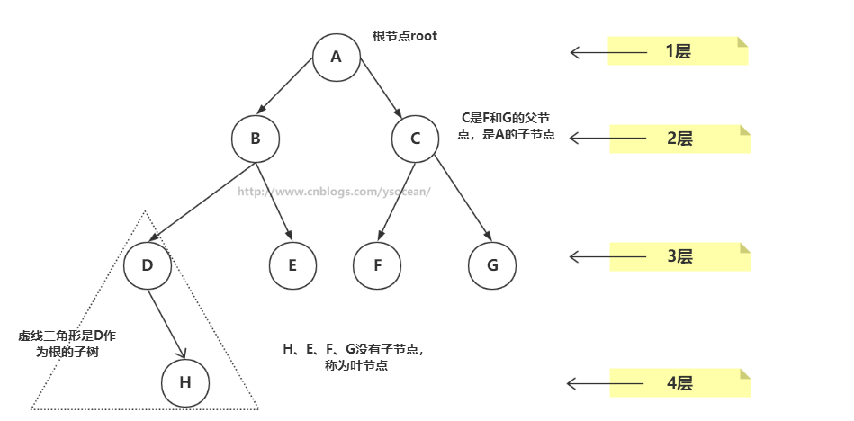

​       ①、**路径**：顺着节点的边从一个节点走到另一个节点，所经过的节点的顺序排列就称为“路径”。

　　②、**根**：树顶端的节点称为根。一棵树只有一个根，如果要把一个节点和边的集合称为树，那么从根到其他任何一个节点都必须有且只有一条路径。A是根节点。

　　③、**父节点**：若一个节点含有子节点，则这个节点称为其子节点的父节点；B是D的父节点。

　　④、**子节点**：一个节点含有的子树的根节点称为该节点的子节点；D是B的子节点。

　　⑤、**兄弟节点**：具有相同父节点的节点互称为兄弟节点；比如上图的D和E就互称为兄弟节点。

　　⑥、**叶节点**：没有子节点的节点称为叶节点，也叫叶子节点，比如上图的H、E、F、G都是叶子节点。

　　⑦、**子树**：每个节点都可以作为子树的根，它和它所有的子节点、子节点的子节点等都包含在子树中。

　　⑧、**节点的层次**：从根开始定义，根为第一层，根的子节点为第二层，以此类推。

　　⑨、**深度**：对于任意节点n,n的深度为从根到n的唯一路径长，根的深度为0；

　　⑩、**高度**：对于任意节点n,n的高度为从n到一片树叶的最长路径长，所有树叶的高度为0


##### 红黑树

* 特征：

1、节点都有颜色

2、在插入和删除的过程中，要遵循保持这些颜色的不同排列规则

* 红-黑树规则：

1、每个节点不是黑色就是红色的；
2、根节点总是黑色的
3、如果节点是红色的，则它的子节点必须是黑色的（每个路径上不能有两个连续的红色节点）
4、从根节点到叶节点或空子节点的每条路径，必须包含相同数目的黑色节点（相同的黑色高度）

**注意：新插入的节点颜色总是红色的**，这是因为插入一个红色节点比插入一个黑色节点违背红-黑规则的可能性更小，原因是插入黑色节点总会改变黑色高度（违背规则4），但是插入红色节点只有一半的机会会违背规则3（因为父节点是黑色的没事，父节点是红色的就违背规则3）。另外违背规则3比违背规则4要更容易修正。当插入一个新的节点时，可能会破坏这种平衡性


* 红-黑树的自我修正

  * 改变节点颜色

  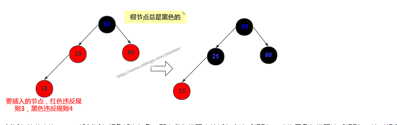

  新插入的节点为15，一般新插入颜色都为红色，那么我们发现直接插入会违反规则3，改为黑色却发现违反规则4。这时候我们将其父节点颜色改为黑色，父节点的兄弟节点颜色也改为黑色。通常其祖父节点50颜色会由黑色变为红色，但是由于50是根节点，所以这里不能改变根节点颜色。

  * 右旋

  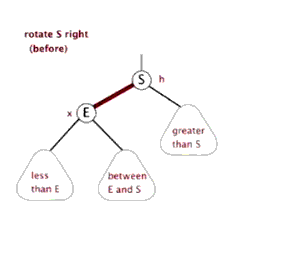

  节点本身是不会旋转的，旋转改变的是节点之间的关系，选择一个节点作为旋转的顶端，如果做一次右旋，这个顶端节点会向下和向右移动到它右子节点的位置，它的左子节点会上移到它原来的位置。右旋的顶端节点必须要有左子节点

  *  左旋

  

  

  左旋的顶端节点必须要有右子节点

  **注意**：改变颜色也是为了帮助判断何时执行什么旋转，而旋转是为了保证树的平衡。光改变节点颜色是不能起到任何作用的，旋转才是关键的操作，在新增节点或者删除节点之后，可能会破坏二叉树的平衡，那么何时执行旋转以及执行什么旋转，这是需要重点关注的。


##### 2-3-4树

2-3-4树每个节点最多有四个子节点和三个数据项，名字中 2,3,4 的数字含义是指一个节点可能含有的子节点的个数。

非叶节点的子节点数总是比它含有的数据项多1。如果子节点个数为L，数据项个数为D，那么：L = D + 1

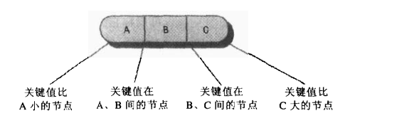

* 搜索

  查找特定关键字值的数据项和在二叉树中的搜索类似。从根节点开始搜索，除非查找的关键字值就是根，否则选择关键字值所在的合适范围，转向那个方向，直到找到为止。

* 插入

  1. 当插入没有满数据项的节点时是很简单的，找到合适的位置，只需要把新数据项插入就可以了，插入可能会涉及到在一个节点中移动一个或其他两个数据项，这样在新的数据项插入后关键字值仍保持正确的顺序

     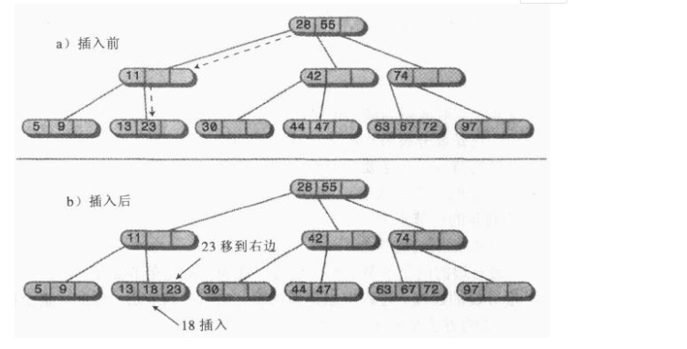

  2. 如果往下寻找插入位置的途中，节点已经满了，那么插入就变得复杂了。发生这种情况时，节点必须分裂，分裂能保证2-3-4树的平衡

     * 节点分裂

       一、创建一个新的空节点，它是要分裂节点的兄弟，在要分裂节点的右边；

       二、数据项C移到新节点中；

       三、数据项B移到要分裂节点104的父节点中；

       四、数据项A保留在原来的位置；

       五、最右边的两个子节点97和112从要分裂处断开，连到新节点上。

       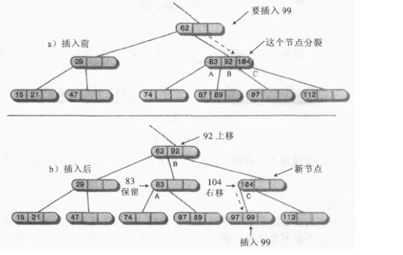

     * 根的分裂

       如果一开始查找插入节点时就碰到满的根节点，那么插入过程更复杂：

       　　①、创建新的根节点，它是要分裂节点的父节点。

       　　②、创建第二个新的节点，它是要分裂节点的兄弟节点；

       　　③、数据项C移到新的兄弟节点中；

       　　④、数据项B移到新的根节点中；

       　　⑤、数据项A保留在原来的位置；

       　　⑥、要分裂节点最右边的两个子节点断开连接，连到新的兄弟节点中。

       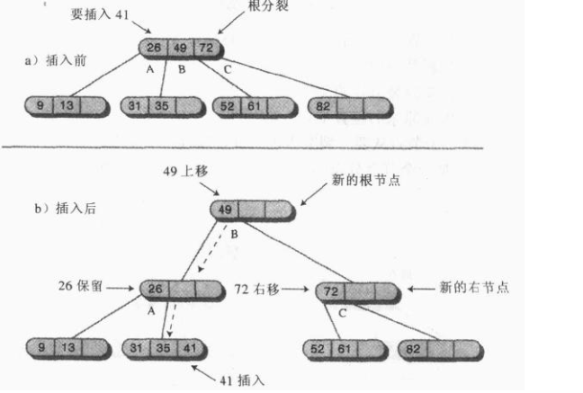

     * 分析2-3-4树我们可以和红黑树作比较分析。红-黑树的层数（平衡二叉树）大约是log2(N+1)，而2-3-4树每个节点可以最多有4个数据项，如果节点都是满的，那么高度和log4N。因此在所有节点都满的情况下，2-3-4树的高度大致是红-黑树的一半。不过他们不可能都是满的，所以2-3-4树的高度大致在log2(N+1)和log2(N+1)/2。减少2-3-4树的高度可以使它的查找时间比红-黑树的短一些。

       　　但是另一方面，每个节点要查看的数据项就多了，这会增加查找时间。因为节点中用线性搜索来查看数据项，使得查找时间的倍数和M成正比，即每个节点数据项的平均数量。总的查找时间和M*log4N成正比


##### 哈希表

Hash表也称散列表，也有直接译作哈希表，Hash表是一种根据关键字值（key - value）而直接进行访问的数据结构。它基于数组，通过把关键字映射到数组的某个下标来加快查找速度，但是又和数组、链表、树等数据结构不同，在这些数据结构中查找某个关键字，通常要遍历整个数据结构，也就是O(N)的时间级，但是对于哈希表来说，只是O(1)的时间级

**哈希函数。把一个大范围的数字哈希（转化）成一个小范围的数字，这个小范围的数对应着数组的下标。使用哈希函数向数组插入数据后，这个数组就是哈希表**


* 冲突解决

  把巨大的数字范围压缩到较小的数字范围，那么肯定会有几个不同的数哈希化到同一个数组下标，即产生了**冲突**。

  1. 开放地址法

     开发地址法中，若数据项不能直接存放在由哈希函数所计算出来的数组下标时，就要寻找其他的位置。分别有三种方法：线性探测、二次探测以及再哈希法。
  
     * 线性探测
  
       在线性探测中，它会线性的查找空白单元。比如如果 5421 是要插入数据的位置，但是它已经被占用了，那么就使用5422，如果5422也被占用了，那么使用5423，以此类推，数组下标依次递增，直到找到空白的位置。这就叫做线性探测，因为它沿着数组下标一步一步顺序的查找空白单元
  
     * 二次探测
  
       线性探测中，如果哈希函数计算的原始下标是x, 线性探测就是x+1, x+2, x+3, 以此类推；而在二次探测中，探测的过程是x+1, x+4, x+9, x+16，以此类推，到原始位置的距离是步数的平方
  
     * 再哈希法
  
       方法是把关键字用不同的哈希函数再做一遍哈希化，用这个结果作为步长。对于指定的关键字，步长在整个探测中是不变的，不过不同的关键字使用不同的步长。第二个哈希函数必须具备如下特点：
  
       　　一、和第一个哈希函数不同
  
       　　二、不能输出0（否则，将没有步长，每次探测都是原地踏步，算法将陷入死循环）。
  
       　　专家们已经发现下面形式的哈希函数工作的非常好：stepSize = constant - key % constant; 其中constant是质数，且小于数组容量。
       　　再哈希法要求表的容量是一个质数，假如表长度为15(0-14)，非质数，有一个特定关键字映射到0，步长为5，则探测序列是0,5,10,0,5,10,以此类推一直循环下去。算法只尝试这三个单元，所以不可能找到某些空白单元，最终算法导致崩溃。如果数组容量为13, 质数，探测序列最终会访问所有单元。即0,5,10,2,7,12,4,9,1,6,11,3,一直下去，只要表中有一个空位，就可以探测到它。
       
       
  
* 链地址法
  
  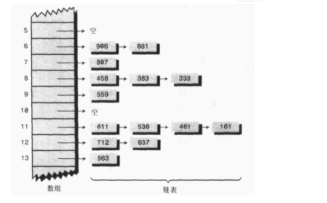
  
  在哈希表每个单元中设置链表（即链地址法），某个数据项的关键字值还是像通常一样映射到哈希表的单元，而数据项本身插入到这个单元的链表中。其他同样映射到这个位置的数据项只需要加到链表中，不需要在原始的数组中寻找空位
  
  
##### 堆

* 它是完全二叉树，除了树的最后一层节点不需要是满的，其它的每一层从左到右都是满的。注意下面两种情况，第二种最后一层从左到右中间有断隔，那么也是不完全二叉树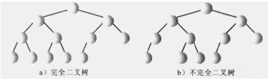

* 堆中的每一个节点的关键字都大于（或等于）这个节点的子节点的关键字


  

  


### 算法

#### 1.排序算法

##### 希尔排序

直接插入排序基本思想是每一步将一个待排序的记录，插入到前面已经排好序的有序序列中去，直到插完所有元素为止

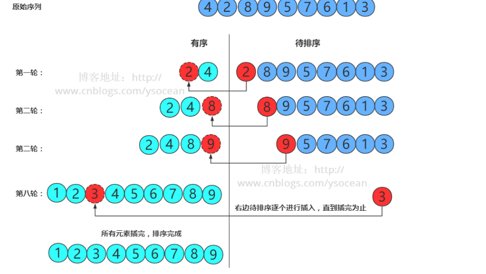

**希尔排序通过加大插入排序中元素的间隔，并在这些有间隔的元素中进行插入排序，从而使数据项能够大跨度的移动。当这些数据项排过一趟序后，希尔排序算法减小数据项的间隔再进行排序，依次进行下去，最后间隔为1时，就是我们上面说的简单的直接插入排序**

* 排序间隔选取

  对于10个元素，我们选取4的间隔，那么100个数据，1000个数据，甚至更多的数据，我们应该怎么选取间隔呢？

  　　希尔的原稿中，他建议间隔选为N/2，也就是每一趟都将排序分为两半，因此对于N=100的数组，逐渐减小的间隔序列为：50,25,12，6,3,1。这个方法的好处是不需要在开始排序前为找到初始序列的间隔而计算序列，只需要用2整除N。但是这已经被证明并不是最好的序列。

  　　**间隔序列中的数字互质是很重要的指标，也就是说，除了1，他们没有公约数。这个约束条件使得每一趟排序更有可能保持前一趟排序已经排好的结果，而希尔最初以N/2的间隔的低效性就是没有遵守这个准则。**

  　　所以一种希尔的变形方法是用2.2来整除每一个间隔，对于n=100的数组，会产生序列45，20，9,4,1。这比用2会整除会显著的改善排序效果。

  　　还有一种很常用的间隔序列：**knuth 间隔序列 3h+1**

  　　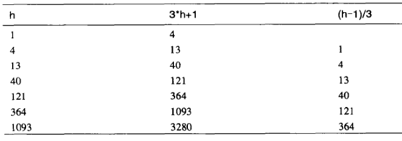

  　　**但是无论是什么间隔序列，最后必须满足一个条件，就是逐渐减小的间隔最后一定要等于1，因此最后一趟排序一定是简单的插入排序。**

```java
/**
     * knuth间隔序列的希尔排序算法实现
     * @param array
     * @return
     */
    public static int[] sort(int []array){
        int lenth=array.length;
        System.out.println("原来数组:"+ Arrays.toString(array));
        int step=1;
        while (step<=lenth/3){
            step=step*3+1;
        }
        while (step>0){
            for(int i=step;i<lenth;i++){
                int temp=array[i];
                int j=i;
                while (j>step-1&&array[j-step]>temp){
                    array[j]=array[j-step];
                    j-=step;
                }
                array[j]=temp;
            }
            System.out.println(step+"轮:"+ Arrays.toString(array));
            step=step/3;
        }
        return array;

    }
//差别只在于这个间隔h的选取
 /**
     * 为length/2的希尔排序
     * @param array
     * @return
     */
    public static int[] sort2(int[] array){
        int lenth=array.length;
        System.out.println("原来:"+ Arrays.toString(array));
        for(int step=lenth/2;step>0;step/=2){
            for(int i=step;i<lenth;i++){
                int temp=array[i];
                int j=i;
                while (j>step-1&&array[j-step]>temp){
                    array[j]=array[j-step];
                    j-=step;
                }
                array[j]=temp;
            }
            System.out.println(step+"轮:"+ Arrays.toString(array));
        }
        return array;
    }
```

##### 快速排序

　快速排序是对冒泡排序的一种改进，采用的是分治策略（一般与递归结合使用），以减少排序过程中的比较次数

* 快速排序的思路

  ​        一、先通过第一趟排序，将数组原地划分为两部分**（一般以数组最左边为准），**其中一部分的所有数据都小于另一部分的所有数据**。**原数组被划分为2份

  　　二、通过递归的处理， 再对原数组分割的两部分分别划分为两部分，同样是使得其中一部分的所有数据都小于另一部分的所有数据。 这个时候原数组被划分为了4份

  　　三、就1,2被划分后的最小单元子数组来看，它们仍然是无序的，但是！ 它们所组成的原数组却逐渐向有序的方向前进。

  　　四、这样不断划分到最后，数组就被划分为多个由一个元素或多个相同元素组成的单元，这样数组就有序了。

* 快速排序的算法实现

  假设被排序的无序区间为[A[i],......,A[j]]

  　　**一、基准元素选取：**选择其中的一个记录的关键字 v 作为基准元素（控制关键字）;**怎么选取关键字？**

  　　**二、划分：**通过基准元素 v 把无序区间 A[I]......A[j] 划分为左右两部分，使得左边的各记录的关键字都**小于** v；右边的各记录的关键字都**大于等于** v；**（如何划分？）**

  　　**三、递归求解：重复上面的一、二步骤，**分别对左边和右边两部分递归进行快速排序。

  　　**四、组合：**左、右两部分均有序，那么整个序列都有序。

  　　上面的第 三、四步不用多说，主要是第一步怎么选取关键字，从而实现第二步的划分？

  　　划分的过程涉及到三个关键字：**“基准元素”、“左游标”、“右游标”**

  　　**基准元素：**它是将数组划分为两个子数组的过程中，用于界定大小的值，以它为判断标准，将小于它的数组元素“划分”到一个“小数值的数组”中，而将大于它的数组元素“划分”到一个“大数值的数组”中，这样，我们就将数组分割为两个子数组，而其中一个子数组的元素恒小于另一个子数组里的元素。

  　　**左游标：**它一开始指向待分割数组最左侧的数组元素，在排序的过程中，它将向右移动。

  　　**右游标：**它一开始指向待分割数组最右侧的数组元素，在排序的过程中，它将向左移动。

  　　注意：上面描述**的基准元素/右游标/左游标**都是**针对单趟排序过程**的， 也就是说，在整体排序过程的**多趟排序中**，各趟排序取得的基准元素/右游标/左游标**一般都是不同的。**

  　　**对于基准元素的选取，原则上是任意的。但是一般我们选取数组中第一个元素为基准元素（假设数组是随机分布的）**

  ```java
      public static void sort(int []array){
    quickSort(array,0,array.length-1);
      }
  
      /**
       * 递归分数组
       * @param array
       * @param start
       * @param end
       */
      public static void quickSort(int[]array,int start,int end ){
          if(start>=end){
              return ;
          }else {
              int index=getIndex(array,start,end);
              quickSort(array,start,index-1);
              quickSort(array,index+1,end);
          }
      }
  
      /**
       * 划分左右数组并且返回标准值索引
       * @param array
       * @param left
       * @param right
       * @return
       */
      public static int getIndex(int[]array,int left,int right){
          int index=left;
          int num=array[index];
          while (left<right){
              while (left<right&&array[right]>=num){
                  right--;
              }
              while (left<right&&array[left]<=num){
                  left++;
              }
              int temp=array[right];
              array[right]=array[left];
              array[left]=temp;
          }
          array[index]=array[left];
          array[left]=num;
          return left;
      }
  ```


#### 2.算法题目

1. 请实现一个函数，将一个字符串中的每个空格替换成“%20”。例如，当字符串为We Are Happy.则经过替换之后的字符串为We%20Are%20Happy。

   ```java
   /**
        * 请实现一个函数，将一个字符串中的每个空格替换成“%20”
        * 例如，当字符串为We Are Happy.则经过替换之后的字符串
        * 为We%20Are%20Happy
        * @param str
        * @return
        */
       public static String replaceSpace(StringBuffer str) {
          int spacenum=0;
           int oldlen=str.length();
           for(int i=0;i<oldlen;i++){
              if(str.charAt(i)==' '){
                  spacenum++;
              }
          }
           int newlength=oldlen+spacenum*2;
          str.setLength(newlength);
          newlength--;
          oldlen--;
          System.out.println(str.length());
          for(int i=newlength;i>=0&&oldlen>=0;i--,oldlen--){
              if(str.charAt(oldlen)!=' '){
                  str.setCharAt(newlength--,str.charAt(oldlen));
              }else {
                  str.setCharAt(newlength--,'0');
                  str.setCharAt(newlength--,'2');
                  str.setCharAt(newlength--,'%');
              }
          }
          return new String(str);
       }
   ```

2. 输入某二叉树的前序遍历和中序遍历的结果，请重建出该二叉树。假设输入的前序遍历和中序遍历的结果中都不含重复的数字。例如输入前序遍历序列{1,2,4,7,3,5,6,8}和中序遍历序列{4,7,2,1,5,3,8,6}，则重建二叉树并返回。

   ```java
        public class TreeNode {
             int val;
             TreeNode left;
             TreeNode right;
             TreeNode(int x) { val = x; }
         }
   
       public  TreeNode reConstructBinaryTree(int [] pre,int [] in) {
             if(pre.length==0||in.length==0){
                 return null;
             }
           TreeNode node = new TreeNode(pre[0]);
             for(int i=0;i<in.length;i++){
                 if(pre[0]==in[i]){
                     node.left=reConstructBinaryTree(Arrays.copyOfRange(pre,1,i+1),Arrays.copyOfRange(in,0,i));
                     node.right=reConstructBinaryTree(Arrays.copyOfRange(pre,i+1,pre.length),Arrays.copyOfRange(in,i+1,in.length));
                 }
             }
             return node;
       }
   ```

3. 输入一个整数，输出该数二进制表示中1的个数。其中负数用补码表示。

   ```java
   public static int NumberOf1(int n) {
         int count=0;
         while (n!=0){
             if((n&1)==1){
                 count++;
             }
             n=n>>>1;
         }
         return count;
       }
   ```

4. 输入一个整数数组，实现一个函数来调整该数组中数字的顺序，使得所有的奇数位于数组的前半部分，所有的偶数位于数组的后半部分，并保证奇数和奇数，偶数和偶数之间的相对位置不变。

   ```java
       public static void reOrderArray(int [] array) {
           int len=array.length;
   
           for(int i=0;i<len;i++){
               int j=i;
               int tem=array[i];
               while (j>0&&array[j]%2==1){
                   if(array[j-1]%2==0){
                       array[j]=array[j-1];
                       array[j-1]=tem;
                   }
                   j--;
               }
           }
       }
   ```

5. 输入一个链表，输出该链表中倒数第k个结点。

   ```java
    /**
        * 输入一个链表，输出该链表中倒数第k个结点
        * @param head
        * @param k
        * @return
        */
       public  static ListNode FindKthToTail(ListNode head,int k) {
           if(head==null){
               return null;
           }
         ListNode node=head;
           ListNode node1=head;
         int count=0;
         for(;node!=null;node=node.next){
             count++;
         }
         if(count<k){
             return null;
         }
         int x=count-k;
         for(int i=0;i<x;i++){
   //          System.out.println(node1.val);
             node1=node1.next;
         }
   //      System.out.println(node1.val);
         return node1;
   
       }
   ```

6. ```java
   输入一个链表，反转链表后，输出新链表的表头
   public  static ListNode ReverseList(ListNode head) {
           if(head==null){
               return null;
           }
           ListNode pre=null;
           ListNode next=null;
   
           while (head!=null){
               next=head.next;
               head.next=pre;
               pre=head;
               head=next;
           }
           return pre;
       }
   ```

7. 输入两个单调递增的链表，输出两个链表合成后的链表，当然我们需要合成后的链表满足单调不减规则。

   ```java
   public ListNode Merge(ListNode list1,ListNode list2) {
               if(list1==null){
                   return list2;
               }
               if(list2==null){
                   return list1;
               }
              ListNode head=null;
              ListNode next=null;
              while (list1!=null&&list2!=null){
                  if(list1.val<list2.val){
                     if(head==null){
                         head=next=list1;
                     }else {
                         next.next=list1;
                         next=list1;
                     }
                     list1=list1.next;
                  }else {
                      if(head==null){
                          head=next=list2;
                      }else {
                          next.next=list2;
                          next=list2;
                      }
                      list2=list2.next;
                  }
              }
              if(list1==null){
                  next.next=list2;
              }else {
                  next.next=list1;}
           return head;
       }
    /**
        * 递归实现 输入两个单调递增的链表，输出两个链表合成后的链表
        * @param list1
        * @param list2
        * @return
        */
       public ListNode Merge1(ListNode list1,ListNode list2) {
           if(list1==null){
               return list2;
           }
           if(list2==null){
               return list1;
           }
               if(list1.val<=list2.val){
                   list1.next=Merge1(list1.next,list2);
                   return list1;
               }else {
                   list2.next=Merge1(list1,list2.next);
                   return list2;
               }
   
   
       }
   ```

8. 输入两棵二叉树A，B，判断B是不是A的子结构。（ps：我们约定空树不是任意一个树的子结构）

   ```java
   
       /**
        * 输入两棵二叉树A，B，判断B是不是A的子结构。（ps：我们约定空树不是任意一个树的子结构）
        * @param root1
        * @param root2
        * @return
        */
       public boolean HasSubtree(TreeNode root1, TreeNode root2) {
          if(root1==null||root2==null){
              return false;
          }
   
           boolean flag = false;
           if (root1.val == root2.val) {
               flag = isLike(root1, root2);
           }
          if(!flag){
              flag=HasSubtree(root1.left,root2);
          }
          if(!flag){
              flag=HasSubtree(root1.right,root2);
          }
          return flag;
       }
       public boolean isLike(TreeNode root1, TreeNode root2){
           if (root1==null&&root2!=null){
               return false;
           }
           if (root2==null){
               return true;
           }
           if(root1.val!=root2.val){
               return false;
           }
           return isLike(root1.left,root2.left)&&isLike(root1.right,root2.right);
       }
   
   ```

   

9. 操作给定的二叉树，将其变换为源二叉树的镜像。

   ```java
   a二叉树的镜像定义：源二叉树 
       	    8
       	   /  \
       	  6   10
       	 / \  / \
       	5  7 9 11
       	镜像二叉树
       	    8
       	   /  \
       	  10   6
       	 / \  / \
       	11 9 7  5
       
       
           /**
        * 操作给定的二叉树，将其变换为源二叉树的镜像。
        * @param root
        */
       public void Mirror(TreeNode root) {
           if(root==null){
               return;
           }
           TreeNode treeNode=root.left;
           root.left=root.right;
           root.right=treeNode;
           Mirror(root.left);
           Mirror(root.right);
   
       }
   
   ```

   

10. 

    

