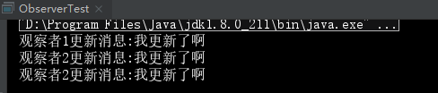

[TOC]

### 开闭原则

* 开闭原则的含义是：当应用的需求改变时，在不修改软件实体的源代码或者二进制代码的前提下，可以扩展模块的功能，使其满足新的需求。

* 实现通过“抽象约束、封装变化”来实现开闭原则，即通过接口或者抽象类为软件实体定义一个相对稳定的抽象层，而将相同的可变因素封装在相同的具体实现类中。因为抽象灵活性好，适应性广，只要抽象的合理，可以基本保持软件架构的稳定。而软件中易变的细节可以从抽象派生来的实现类来进行扩展，当软件需要发生变化时，只需要根据需求重新派生一个实现类来扩展就可以了。  

### 里氏替换原则

* 含义：继承必须确保超类所拥有的性质在子类中仍然成立
* 作用：
  * 里氏替换原则是实现开闭原则的重要方式之一。
  * 它克服了继承中重写父类造成的可复用性变差的缺点。
  * 它是动作正确性的保证。即类的扩展不会给已有的系统引入新的错误，降低了代码出错的可能性。
* 实现：**子类可以扩展父类的功能，但不能改变父类原有的功能**

  例如，企鹅、鸵鸟和几维鸟从生物学的角度来划分，它们属于鸟类；但从类的继承关系来看，由于它们不能继承“鸟”会飞的功能，所以它们不能定义成“鸟”的子类。同样，由于“气球鱼”不会游泳，所以不能定义成“鱼”的子类。


### 依赖倒置原则

* 含义：高层模块不应该依赖低层模块，两者都应该依赖其抽象；抽象不应该依赖细节，细节应该依赖抽象。**核心思想是：要面向接口编程，不要面向实现编程**
* 作用：
  * 依赖倒置原则是实现开闭原则的重要途径之一，它降低了客户与实现模块之间的耦合。
  * 依赖倒置原则可以减少并行开发引起的风险。
  * 依赖倒置原则可以提高代码的可读性和可维护性。
* 实现：
  * 每个类尽量提供接口或抽象类，或者两者都具备
  * 变量的声明类型尽量是接口或者是抽象类
  * 任何类都不应该从具体类派生
  * 使用继承时尽量遵循里氏替换原则

### 单一职责原则

* 定义：单一职责原则规定一个类应该有且仅有一个引起它变化的原因，否则类应该被拆分。该原则提出对象不应该承担太多职责

* 实现：

  单一职责原则是最简单但又最难运用的原则，需要设计人员发现类的不同职责并将其分离，再封装到不同的类或模块中

### 接口隔离原则

* 定义：要求程序员尽量将臃肿庞大的接口拆分成更小的和更具体的接口，让接口中只包含客户感兴趣的方法。一个类对另一个类的依赖应该建立在最小的接口上
* 实现：
  * 接口尽量小，但是要有限度。一个接口只服务于一个子模块或业务逻辑
  * 为依赖接口的类定制服务。只提供调用者需要的方法，屏蔽不需要的方法
  * 了解环境，拒绝盲从。每个项目或产品都有选定的环境因素，环境不同，接口拆分的标准就不同深入了解业务逻辑
  * 提高内聚，减少对外交互。使接口用最少的方法去完成最多的事情

### 迪米特法则

* 定义：迪米特法则又叫作最少知识原则，如果两个软件实体无须直接通信，那么就不应当发生直接的相互调用，可以通过第三方转发该调用。其目的是降低类之间的耦合度，提高模块的相对独立性。

* 实现：

  * 从依赖者的角度来说，只依赖应该依赖的对象
  * 从被依赖者的角度说，只暴露应该暴露的方法。
  * 在类的划分上，应该创建弱耦合的类。类与类之间的耦合越弱，就越有利于实现可复用的目标
  * 在类的结构设计上，尽量降低类成员的访问权限。
  * 在类的设计上，优先考虑将一个类设置成不变类。
  * 在对其他类的引用上，将引用其他对象的次数降到最低。
  * 不暴露类的属性成员，而应该提供相应的访问器（set 和 get 方法）
  * 谨慎使用序列化（Serializable）功能。

  

### 合成复用原则

* 定义：合成复用原则又叫组合/聚合复用原则。它要求在软件复用时，要尽量先使用组合或者聚合等关联关系来实现，其次才考虑使用继承关系来实现。如果要使用继承关系，则必须严格遵循里氏替换原则
* 实现：合成复用原则是通过将已有的对象纳入新对象中，作为新对象的成员对象来实现的，新对象可以调用已有对象的功能，从而达到复用。

  

### 1.单例设计模式

  单例设计模式保证一个类仅有一个实例，并提供一个访问它的方法

#### 1.1结构


#### 1.2懒汉式单例
  * 该模式的特点是类加载时没有生成单例，只有当第一次调用 getlnstance 方法时才去创建这个单例

```
public class LazySingleton {
    /**
     * 利用静态变量来记录Singleton的唯一实例
     */
    private static LazySingleton lazySingleton=null;

    /**
     * 构造方法私有化，避免被创建实例
     */

    private LazySingleton(){
    }
    public static LazySingleton getInstance(){
        if(lazySingleton==null){
            lazySingleton=new LazySingleton();
        }
        return lazySingleton;
    }
}
```
  * 线程安全的懒汉模式

```
public class SynLazySingleton {
    /**
     * 利用静态变量来记录Singleton的唯一实例
     */
    private static SynLazySingleton synLazySingleton=null;
    /**
     * 构造方法私有化，避免被创建实例
     */
    private SynLazySingleton(){}
    /*
      直接加synronized关键字
     public static synchronized LazySingleton getInstance(){
        if(lazySingleton==null){
            lazySingleton=new LazySingleton();
        }
        return lazySingleton;
    }
     */

    /**
     *  用“双重检查加锁”，在getInstance()中减少使用同步
     * @return SynLazySingleton
     */
    public static SynLazySingleton getInstance(){
        if(synLazySingleton==null){
            synchronized (SynLazySingleton.class){
                if (synLazySingleton==null){
                    synLazySingleton= new SynLazySingleton();
                }
            }
        }
        return synLazySingleton;
    }
}
```


#### 1.3饿汉模式

该模式的特点是类一旦加载就创建一个单例，保证在调用 getInstance 方法之前单例已经存在了

```
public class HungrySingleton {
    /**
     * 创建实例对象
     */
    private static HungrySingleton hungrySingleton=new HungrySingleton();

    private HungrySingleton(){}

    public static HungrySingleton getInstance(){
        return hungrySingleton;
    }
}
```
#### 1.4总结
* 单例模式中确保程序中一个类最多只有一个实例
* 单例模式的构造器是私有，必须要提供实例的全局访问点
* 单例模式可能会因为多线程的问题而带来安全隐患
* 由于系统中只存在一个实例对象，可以严格控制客户怎样以及何时访问它，节约了系统资源
* 如果实例化的对象长时间不被利用，系统会认为它是垃圾，会自动销毁并回收资源，下次利用时又将重新实例化，这将导致对象状态的丢失。
* 在一个系统中要求一个类只有一个实例时才应当使用单例模式。反过来，如果一个类可以有几个实例共存，就需要对单例模式进行改进，使之成为多例模式

### 2.代理模式
    给某一个对象提供一个代理，并由代理对象控制对原对象的引用，它是一种对象结构型模式
#### 2.1模式结构
* 抽象主题（Subject）类：通过接口或抽象类声明真实主题和代理对象实现的业务方法
* 真实主题（RealSubject）类：实现了抽象主题中的具体业务，是代理对象所代表的真实对象，是最终要引用的对象
* 代理（Proxy）类：提供了与真实主题相同的接口，其内部含有对真实主题的引用，它可以访问、控制或扩展真实主题的功能


#### 2.2代码示例

```
public interface Subject {
    /**
     *抽象主题方发request
     */
    public void Request();
}


public class RealSubject implements Subject {
    /**
     * 实现Subject的抽象方法
     */
    public void Request() {
        System.out.println("真实主题方法来了");
    }
}


public class Proxy {
    private RealSubject realSubject;

    /**
     * 调用真实主题方法
     */
    public void Requset(){
        if(realSubject==null){
            realSubject=new RealSubject();
        }
        realSubject.Request();
    }
}


```

#### 2.3应用场景

* 远程代理，为一个位于不同的地址空间的对象提供一个本地 的代理对象，方便客户端访问
* 虚拟代理，这种方式通常用于要创建的目标对象开销很大时，先创建一个消耗相对较小的对象来表示，真实对象只在需要时才会被真正创建
* 安全代理，控制真是对象访问时的权限
* 智能指引，调用真实的对象时，代理处理另外一些事物

#### 2.4总结 

* 优点：
  * 代理模式能够协调调用者和被调用者，在一定程度上降低了系 统的耦合度
  * 远程代理使得客户端可以访问在远程机器上的对象，远程机器 可能具有更好的计算性能与处理速度，可以快速响应并处理客户端请求
  * 虚拟代理通过使用一个小对象来代表一个大对象，可以减少系 统资源的消耗，对系统进行优化并提高运行速度
  * 保护代理可以控制对真实对象的使用权限
* 缺点：
  * 由于在客户端和真实主题之间增加了代理对象，因此 有些类型的代理模式可能会造成请求的处理速度变慢
  * 实现代理模式需要额外的工作，有些代理模式的实现 非常复杂


### 3.责任链模式（职责链模式）

为了避免请求发送者与多个请求处理者耦合在一起，将所有请求的处理者通过前一对象记住其下一个对象的引用而连成一条链；当有请求发生时，可将请求沿着这条链传递，直到有对象处理它为止

#### 3.1模式结构

* 抽象处理者（Handler）角色：定义一个处理请求的接口，包含抽象处理方法和一个后继连接
* 具体处理者（Concrete Handler）角色：实现抽象处理者的处理方法，判断能否处理本次请求，如果可以处理请求则处理，否则将该请求转给它的后继者
* 客户类（Client）角色：创建处理链，并向链头的具体处理者对象提交请求，它不关心处理细节和请求的传递过程


#### 3.2 代码示例

```java
//抽象处理者角色
public abstract class Handler {
    private Handler next;

    public Handler getNext() {
        return next;
    }

    public void setNext(Handler next) {
        this.next = next;
    }
    public abstract void handleRequest(int request);
}


//具体处理者角色1
public class ConcreteHandler1 extends Handler {
    @Override
    /**
     * 对请求进行处理，符合条件等我处理请求，不符合的转发请求
     * @param request
     */
    public void handleRequest(int request) {
          if(request==1){
              System.out.println("1号进行了处理");
          }
          else {
              if(getNext()!=null){
                  getNext().handleRequest(request);
              }else {
                  System.out.println("没人处理");
              }
          }
    }
}


//具体处理者角色2
public class ConcreteHandler2 extends Handler {
    /**
     * 对请求进行处理，符合条件等我处理请求，不符合的转发请求
     * @param request
     */
    @Override
    public void handleRequest(int request) {
        if(request>1){
            System.out.println("2号进行了处理");
        }
        else {
            if(getNext()!=null){
                getNext().handleRequest(request);
            }else {
                System.out.println("没人处理");
            }
        }
    }
}


/**
 * 组装请求处理
 */
public class ChainClient {
    public static void main(String[] args) {

        Handler h1=new ConcreteHandler1();
        Handler h2=new ConcreteHandler2();
        h1.setNext(h2);
        h1.handleRequest(1);
        h1.handleRequest(2);
        h1.handleRequest(-1);
    }
}
```

 #### 3.3应用场景

  责任链模式通常在以下几种情况使用。

1. 有多个对象可以处理一个请求，哪个对象处理该请求由运行时刻自动确定。
2. 可动态指定一组对象处理请求，或添加新的处理者。
3. 在不明确指定请求处理者的情况下，向多个处理者中的一个提交请求。

#### 3.4总结

* 优点：
  * 降低了对象之间的耦合度，该模式使得一个对象无须知道到底是哪一个对象处理其请求以及链的结构，发送者和接收者也无须拥有对方的明确信息
  * 增强了系统的可扩展性。可以根据需要增加新的请求处理类。
  * 增强了给对象指派职责的灵活性。当工作流程发生变化，可以动态地改变链内的成员或者调动它们的次序，也可动态地新增或者删除责任
  * 责任分担。每个类只需要处理自己该处理的工作，不该处理的传递给下一个对象完成，明确各类的责任范围。
  
* 缺点：
  * 不能保证每个请求一定被处理。由于一个请求没有明确的接收者，所以不能保证它一定会被处理，该请求可能一直传到链的末端都得不到处理
  * 对比较长的职责链，请求的处理可能涉及多个处理对象，系统性能将受到一定影响
  * 职责链建立的合理性要靠客户端来保证，增加了客户端的复杂性，可能会由于职责链的错误设置而导致系统出错，如可能会造成循环调用

   
  
### 4.简单工厂模式

  简单工厂模式又称之为静态工厂方法，属于创建型模式。在简单工厂模式中，可以根据传递的参数不同，返回不同类的实例

  #### 4.1 模式结构


* Factory：工厂角色

  提供一个方法，该方法根据传递的参数不同返回不同类的具体实例

*  Product：抽象产品角色。为所有产品的父类，负责描述所有实例所共有的公共接口

*  ConcreteProduct：具体的产品角色。

#### 4.2代码示例

    * 创建Product抽象类

```java

public abstract class Product {
    public abstract void used();
}
```

* 创建A和B两个具体Product

  ```java
  public class ConcreteProductA extends Product{
  
  @Override
      public void used() {
         System.out.println("A在使用着");
      }
  }
  
  public class ConcreteProductB extends Product {
      @Override
      public void used() {
          System.out.println("B在使用");
      }
  }
  ```

* 制造工厂

  ```java
  public class Factory {
      public Product creteProduct(String arg){
          if("A".equals(arg)){
              return new ConcreteProductA();
          }else if ("B".equals(arg)){
              return new ConcreteProductB();
          }else {
              return null;
          }
      }
  }
  ```

* 测试商店

  ```java
    @Test
      /*
       * 测试工厂生产类
       */
      public void simpleFactory(){
          Factory factory=new Factory();
          Product product=factory.creteProduct("A");
          product.used();
          Product product2=factory.creteProduct("B");
          product2.used();
      }
  ```

  

#### 4.3 使用场景

* 工厂类负责创建的对象比较少。
* 客户端只知道传入工厂类的参数，对于如何创建对象不关心

#### 4.4总结

* 优点
  * 工厂类含有必要的判断逻辑，可以决定在什么时候创建哪一个产品类的实例，客户端可以免除直接创建产品对象的责任，而仅仅“消费”产品；简单工厂模式通过这种做法实现了对责任的分割，它提供了专门的工厂类用于创建对象
  * 客户端无须知道所创建的具体产品类的类名，只需要知道具体产品类所对应的参数即可，对于一些复杂的类名，通过简单工厂模式可以减少使用者的记忆量
  * 通过引入配置文件，可以在不修改任何客户端代码的情况下更换和增加新的具体产品类，在一定程度上提高了系统的灵活性
* 缺点：
  * 由于工厂类集中了所有产品创建逻辑，一旦不能正常工作，整个系统都要受到影响
  * 使用简单工厂模式将会增加系统中类的个数，在一定程序上增加了系统的复杂度和理解难度
  * 系统扩展困难，一旦添加新产品就不得不修改工厂逻辑，在产品类型较多时，有可能造成工厂逻辑过于复杂，不利于系统的扩展和维护
  * 简单工厂模式由于使用了静态工厂方法，造成工厂角色无法形成基于继承的等级结构
* 简单工厂模式包含三个角色：工厂角色负责实现创建所有实例的内部逻辑；抽象产品角色是所创建的所有对象的父类，负责描述所有实例所共有的公共接口；具体产品角色是创建目标，所有创建的对象都充当这个角色的某个具体类的实例


### 5.工厂方法模式

工厂方法模式(Factory Method Pattern)又称为工厂模式，也叫虚拟构造器(Virtual Constructor)模式或者多态工厂(Polymorphic Factory)模式.工厂方法模式定义了一个创建对象的接口，但由子类决定要实例化的类是哪一个。

#### 5.1模式结构


* 抽象工厂（Abstract Factory）：提供了创建产品的接口，调用者通过它访问具体工厂的工厂方法 newProduct() 来创建产品
* 具体工厂（Concrete Factory）：主要是实现抽象工厂中的抽象方法，完成具体产品的创建
* 抽象产品（Product）：定义了产品的规范，描述了产品的主要特性和功能
* 具体产品（Concrete Product）：实现了抽象产品角色所定义的接口，由具体工厂来创建，它同具体工厂之间一一对应


#### 5.2代码分析

* 抽象工厂

  ```java
  //抽象工厂
  public interface Factory {
      public Product newProduct();
  }
  ```

* 具体工厂

  ```java
  //具体产品1
  public class ConcreteProduct1 implements Product {
      public void show() {
          System.out.println("产品1展示");
      }
  }
  
  //具体产品2
  public class ConcreteProduct2 implements Product {
      public void show() {
          System.out.println("产品2展示");
      }
  }
  ```

  

* 抽象产品

  ```java
  
  //抽象产品
  public interface Product {
      public void show()
        ;
  }
  ```

* 具体产品

  ```java
  //具体产品1
  public class ConcreteProduct1 implements Product {
      public void show() {
          System.out.println("产品1展示");
      }
  }
  
  
  //具体产品2
  public class ConcreteProduct2 implements Product {
      public void show() {
          System.out.println("产品2展示");
      }
  }
  
  ```

#### 5.3 适用场景

* 一个类不知道它所需要的对象的类。在工厂方法模式中，我们不需要具体产品的类名，我们只需要知道创建它的具体工厂即可
* 一个类通过其子类来指定创建哪个对象：在工厂方法模式中，对于抽象工厂类只需要提供一个创建产品的接口，而由其子类来确定具体要创建的对象，利用面向对象的多态性，在程序运行时，子类对象将覆盖父类对象，从而使得系统更容易扩展
* 将创建对象的任务委托给多个工厂子类中的某一个，客户端在使用时可以无须关心是哪一个工厂子类创建产品子类，需要时再动态指定

#### 5.4总结

* 优点

  * 在工厂方法中，用户只需要知道所要产品的具体工厂，无须关系具体的创建过程，甚至不需要具体产品类的类名
  * 基于工厂角色和产品角色的多态性设计是工厂方法模式的关键。它能够使工厂可以自主确定创建何种产品对象，而如何创建这个对象的细节则完全封装在具体工厂内部。工厂方法模式之所以又被称为多态工厂模式，是因为所有的具体工厂类都具有同一抽象父类
  * 使用工厂方法模式的另一个优点是在系统中加入新产品时，无须修改抽象工厂和抽象产品提供的接口，无须修改客户端，也无须修改其他的具体工厂和具体产品，而只要添加一个具体工厂和具体产品就可以了

* 缺点

  * 在添加新产品时，需要编写新的具体产品类，而且还要提供与之对应的具体工厂类，系统中类的个数将成对增加，在一定程度上增加了系统的复杂度，有更多的类需要编译和运行，会给系统带来一些额外的开销
  * 由于考虑到系统的可扩展性，需要引入抽象层，在客户端代码中均使用抽象层进行定义，增加了系统的抽象性和理解难度，且在实现时可能需要用到DOM、反射等技术，增加了系统的实现难度

* 使用多个工厂方法：在抽象工厂角色中可以定义多个工厂方法，从而使具体工厂角色实现这些不同的工厂方法，这些方法可以包含不同的业务逻辑，以满足对不同的产品对象的需求

* 如果工厂等级结构中只有一个具体工厂类的话，抽象工厂就可以省略，也将发生了退化。当只有一个具体工厂，在具体工厂中可以创建所有的产品对象，并且工厂方法设计为静态方法时，工厂方法模式就退化成简单工厂模式

  

### 6.抽象工厂模式

#### 6.1 定义

​    提供一个创建一系列相关或相互依赖对象的接口，而无须指定它们具体的类。抽象工厂模式又称为Kit模式，属于对象创建型模式。抽象工厂模式是工厂方法模式的升级版本，工厂方法模式只生产一个等级的产品，而抽象工厂模式可生产多个等级的产品。

* 产品等级

  

#### 6.2模式结构


* 抽象工厂（Abstract Factory）：提供了创建产品的接口，它包含多个创建产品的方法 newProduct()，可以创建多个不同等级的产品
* 具体工厂（Concrete Factory）：主要是实现抽象工厂中的多个抽象方法，完成具体产品的创建。
* 抽象产品（Product）：定义了产品的规范，描述了产品的主要特性和功能，抽象工厂模式有多个抽象产品。
* 具体产品（ConcreteProduct）：实现了抽象产品角色所定义的接口，由具体工厂来创建，它 同具体工厂之间是多对一的关系。

#### 6.3代码实现

* 创建两个抽象生命地区抽象

  ```java
  public interface LifeInJimei {
      public void show();
  }
  
  public interface LifeInXiamen {
      public void show();
  }
  
  ```

* 创建两个工厂的实现类

  ```java
  public class Cat implements LifeInJimei {
      public void show() {
        System.out.println("我是集美一只猫儿");
      }
  }
  
  
  public class Flowers implements LifeInXiamen {
      public void show() {
          System.out.println("我是厦门花儿，开花棒棒");
      }
  }
  
  
  public class Horse implements LifeInXiamen{
      public void show() {
          System.out.println("我是厦门一只马儿");
      }
  }
  
  public class Tree implements LifeInJimei {
      public void show() {
          System.out.println("我是集美树儿长高高");
      }
  }
  ```
  
  

* 创建抽象工厂和实现类

  ```java
  public interface LifeFactory {
      public Object newAnimal(String name) throws ClassNotFoundException, IllegalAccessException, InstantiationException;
      public Object newPlant(String name) throws ClassNotFoundException, IllegalAccessException, InstantiationException;
  }
  
  public class LifeFactoryImp implements LifeFactory{
      /**
       * 使用反射根据传入类名创建具体动物对象
       * @param name
       * @return Animal
       * @throws ClassNotFoundException
       * @throws IllegalAccessException
       * @throws InstantiationException
       */
      public Object newAnimal(String name) throws ClassNotFoundException, IllegalAccessException, InstantiationException {
          String animalName="com.xjm.demo.abstractfactory."+name;
          Class animal=Class.forName(animalName);
          return  animal.newInstance();
      }
  
      /**
       * 使用反射根据传入类名创建具体植物对象
       * @param name
       * @return
       * @throws ClassNotFoundException
       * @throws IllegalAccessException
       * @throws InstantiationException
       */
      public Object newPlant(String name) throws ClassNotFoundException, IllegalAccessException, InstantiationException {
          String plantName="com.xjm.demo.abstractfactory."+name;
          Class plant=Class.forName(plantName);
          return  plant.newInstance();
      }
  }
  ```

#### 6.4使用场景

* 当需要创建的对象是一系列相互关联或相互依赖的产品族时，如电器工厂中的电视机、洗衣机、空调等
* 系统中有多个产品族，但每次只使用其中的某一族产品。如有人只喜欢穿某一个品牌的衣服和鞋。
* 系统中提供了产品的类库，且所有产品的接口相同，客户端不依赖产品实例的创建细节和内部结构

#### 6.5总结

* 抽象工厂模式是所有形式的工厂模式中最为抽象和最具一般性的一种形态。抽象工厂模式与工厂方法模式最大的区别在于，工厂方法模式针对的是一个产品等级结构，而抽象工厂模式则需要面对多个产品等级结构
* 抽象工厂模式的主要优点是隔离了具体类的生成，使得客户并不需要知道什么被创建，而且每次可以通过具体工厂类创建一个产品族中的多个对象，增加或者替换产品族比较方便，增加新的具体工厂和产品族很方便；主要缺点在于增加新的产品等级结构很复杂，需要修改抽象工厂和所有的具体工厂类
* 当抽象工厂模式中每一个具体工厂类只创建一个产品对象，也就是只存在一个产品等级结构时，抽象工厂模式退化成工厂方法模式；当工厂方法模式中抽象工厂与具体工厂合并，提供一个统一的工厂来创建产品对象，并将创建对象的工厂方法设计为静态方法时，工厂方法模式退化成简单工厂模式


### 7.建造者模式

#### 7.1定义

   建造者模式：将一个复杂对象的构建与它的表示分离，使得同样的构建过程可以创建不同的表示

建造者模式是一步一步创建一个复杂的对象，它允许用户只通过指定复杂对象的类型和内容就可以构建它们，用户不需要知道内部的具体构建细节，建造者模式又可以称为生成器模式

#### 7.2 模式结构


* 抽象建造者（Builder）：它是一个包含创建产品各个子部件的抽象方法的接口，通常还包含一个返回复杂产品的方法 getResult()
* 具体建造者(Concrete Builder）：实现 Builder 接口，完成复杂产品的各个部件的具体创建方法
* 产品角色（Product）：它是包含多个组成部件的复杂对象，由具体建造者来创建其各个滅部件
* 指挥者（Director）：它调用建造者对象中的部件构造与装配方法完成复杂对象的创建，在指挥者中不涉及具体产品的信息

#### 7.3代码实现

用建造者（Builder）模式描述客厅装修

分析：客厅是产品，包括墙、电视等组成部分。具体装修工人是具体建造者，他们负责装修与墙、电视的布局。项目经理是指挥者，他负责指挥装修工人进行装修。

* Product产品客厅

  ```java　
  public class LivingRoom {
      private String TV;
      private String wall;
  
      public String getTV() {
          return TV;
      }
  
      public void setTV(String TV) {
          this.TV = TV;
      }
  
      public String getWall() {
          return wall;
      }
  
      public void setWall(String wall) {
          this.wall = wall;
      }
  }
  
  ```

* 抽象构造者Builder

  ```java
  public abstract class Builder {
       protected LivingRoom livingRoom;
  
      /**
       * 构建TV
       */
      public abstract void builderTV();
  
      /**
       * 构建墙壁
       */
       public abstract void builderWall();
       public LivingRoom getResult(){
           return livingRoom;
       }
  }
  ```

* 具体构造者Concrete Builder

```java
public class ConcreteBuilder1 extends Builder {
    @Override
    public void builderTV() {
        livingRoom.setTV("45寸");
    }

    @Override
    public void builderWall() {
         livingRoom.setWall("红色");
    }
}


public class ConcreteBuilder2 extends Builder {
    @Override
    public void builderTV() {
        livingRoom.setTV("20寸");
    }

    @Override
    public void builderWall() {
       livingRoom.setWall("绿色");
    }
}
```


* Director指挥

  ```java
  public class Manager {
      private Builder builder;
  
      public Manager(Builder builder) {
          this.builder = builder;
      }
  
      /**
       * 调用builer组装产品
       * @return
       */
      public LivingRoom getLivingRoom(){
          builder.builderTV();
          builder.builderWall();
          return builder.getResult();
      }
  }
  ```

* 测试

  ```java
   /**
       * 测试建造者模式
       */
      public void buildTest(){
          LivingRoom livingRoom=new LivingRoom();
          Builder b1= new ConcreteBuilder1();
          Builder b2=new ConcreteBuilder2();
          Manager manager=new Manager();
          manager.serBuilder(b1);
          livingRoom=manager.getLivingRoom();
          System.out.println(livingRoom.getTV()+livingRoom.getWall());
          manager.serBuilder(b2);
          livingRoom=manager.getLivingRoom();
          System.out.println(livingRoom.getTV()+livingRoom.getWall());
      }
  ```

  

#### 7.4适用场景

* 需要生成的产品对象有复杂的内部结构，这些产品对象通常包含多个成员属性
* 需要生成的产品对象的属性相互依赖，需要指定其生成顺序
* 对象的创建过程独立于创建该对象的类。在建造者模式中引入了指挥者类，将创建过程封装在指挥者类中，而不在建造者类中。
* 隔离复杂对象的创建和使用，并使得相同的创建过程可以创建不同的产品


#### 7.5总结

* 在建造者模式的结构中引入了一个指挥者类，该类的作用主要有两个：一方面它隔离了客户与生产过程；另一方面它负责控制产品的生成过程。指挥者针对抽象建造者编程，客户端只需要知道具体建造者的类型，即可通过指挥者类调用建造者的相关方法，返回一个完整的产品对象
* 建造者模式的主要优点在于客户端不必知道产品内部组成的细节，将产品本身与产品的创建过程解耦，使得相同的创建过程可以创建不同的产品对象，每一个具体建造者都相对独立，而与其他的具体建造者无关还可以更加精细地控制产品的创建过程；其主要缺点在于由于建造者模式所创建的产品一般具有较多的共同点，其组成部分相似，因此其使用范围受到一定的限制，如果产品的内部变化复杂，可能会导致需要定义很多具体建造者类来实现这种变化，导致系统变得很庞大


#### 7.6 和抽象工厂模式比较

* 与抽象工厂模式相比， **建造者模式返回一个组装好的完整产品** ，而 **抽象工厂模式返回一系列相关的产品，这些产品位于不同的产品等级结构，构成了一个产品族**
* 在抽象工厂模式中，客户端实例化工厂类，然后调用工厂方法获取所需产品对象，而在建造者模式中，客户端可以不直接调用建造者的相关方法，而是通过指挥者类来指导如何生成对象，包括对象的组装过程和建造步骤，它侧重于一步步构造一个复杂对象，返回一个完整的对象。
* 如果将抽象工厂模式看成 **汽车配件生产工厂** ，生产一个产品族的产品，那么建造者模式就是一个 **汽车组装工厂** ，通过对部件的组装可以返回一辆完整的汽车。
* 工厂主要用于生产对象，建造者模式配置对象中的属性

### 结构型模式概述

结构型模式描述如何将类或对象按某种布局组成更大的结构。它**分为类结构型模式和对象结构型模式，前者采用继承机制来组织接口和类，后者釆用组合或聚合来组合对象**。


### 8.适配器模式

#### 8.1定义

   将一个接口转换成客户希望的另一个接口，适配器模式使接口不兼容的那些类可以一起工作，其别名为包装器(Wrapper)。适配器模式既可以作为类结构型模式，也可以作为对象结构型模式。前者类之间的耦合度比后者高，且要求程序员了解现有组件库中的相关组件的内部结构，所以应用相对较少些

#### 8.2模式结构

* 对象适配器


* 类适配器


* 目标（Target）接口：当前系统业务所期待的接口，它可以是抽象类或接口。
* 适配者（Adaptee）类：它是被访问和适配的现存组件库中的组件接口。
* 适配器（Adapter）类：它是一个转换器，通过继承或引用适配者的对象，把适配者接口转换成目标接口，让客户按目标接口的格式访问适配者
* Client：客户类

#### 8.3 代码实现

##### 8.3.1类适配器

  

```java

//目标接口
public interface Target {
    public void request();
}
//某一个适配的请求方法
public class Adaptee {
    public void adapteeRequest(){
        System.out.println("我是适配者的请求方法");
    }
}
//类请求适配器
public class RequstAdapter extends Adaptee implements Target {
    public void request() {
        adapteeRequest();
    }
}
//客户端请求
public class client {
    public static void main(String[] args) {
        Target t=new RequstAdapter();
        t.request();
    }
}

```

##### 8.3.2 对象适配器

```java
  //目标接口
public interface Target {
    public void request();
}
//某一个适配的请求类
public class Adaptee {
    public void adapteeRequest(){
        System.out.println("我是适配者的请求方法");
    }
}

//对象适配器类
public class ObejectAdapter implements Target {
   private Adaptee adaptee;

    public ObejectAdapter(Adaptee adaptee) {
        this.adaptee = adaptee;
    }

    public void request() {
        adaptee.adapteeRequest();
    }
}

  /**
     * 对象适配器测试
     */
    public void objectAdapterTest(){
        Adaptee a=new Adaptee();
        Target t=new ObejectAdapter(a);
        t.request();
    }
```

#### 8.4 使用场景

* 系统需要使用现有的类，而这些类的接口不符合系统的需要

* 想要建立一个可以重复使用的类，用于与一些彼此之间没有太大关联的一些类，包括一些可能在将来引进的类一起工作

#### 8.5 总结

* 对于一些不支持多重继承的编程语言来说（Java ，C#），其使用就会存在一定的局限性：不能将一个适配者类和它的子类都适配到目标接口
* 适配器模式的主要优点是将目标类和适配者类解耦，增加了类的透明性和复用性，同时系统的灵活性和扩展性都非常好，更换适配器或者增加新的适配器都非常方便，符合“开闭原则”；类适配器模式的缺点是适配器类在很多编程语言中不能同时适配多个适配者类，对象适配器模式的缺点是很难置换适配者类的方法
* 当不需要全部实现接口提供的方法时，可先设计一个抽象类实现接口，并为该接口中每个方法提供一个默认实现（空方法），那么该抽象类的子类可有选择地覆盖父类的某些方法来实现需求，它适用于一个接口不想使用其所有的方法的情况


### 9.桥接模式

#### 9.1定义

桥接模式(Bridge Pattern)：将抽象部分与它的实现部分分离，使它们都可以独立地变化。它是一种对象结构型模式，又称为柄体(Handle and Body)模式或接口(Interface)模式

它是用组合关系代替继承关系来实现，从而降低了抽象和实现这两个可变维度的耦合度

**抽象化**：其概念是将复杂物体的一个或几个特性抽出去而只注意其他特性的行动或过程。在面向对象就是将对象共同的性质抽取出去而形成类的过程

**实现化**：针对抽象化给出的具体实现。它和抽象化是一个互逆的过程，实现化是对抽象化事物的进一步具体化

**脱耦**：脱耦就是将抽象化和实现化之间的耦合解脱开，或者说是将它们之间的强关联改换成弱关联，将两个角色之间的继承关系改为关联关系。

桥接模式中的所谓脱耦，就是指在一个软件系统的抽象化和实现化之间使用关联关系（组合或者聚合关系）而不是继承关系，从而使两者可以相对独立地变化，这就是桥接模式的用意


#### 9.2 模式结构


* 抽象化（Abstraction）角色：定义抽象类，并包含一个对实现化对象的引用
* 扩展抽象化（Refined    Abstraction）角色：是抽象化角色的子类，实现父类中的业务方法，并通过组合关系调用实现化角色中的业务方法
* 实现化（Implementor）角色：定义实现化角色的接口，供扩展抽象化角色调用
* 具体实现化（Concrete Implementor）角色：给出实现化角色接口的具体实现。


#### 9.3 代码示例

有一个画笔，可以画正方形、圆形（这个大家都知道怎么做吧，我就不解释了）。但是现在我们需要给这些形状进行上色，这里有三种颜色：白色、红色

```java
//实现化角色
public interface Color {
     public void setColor(String shape);
}

package com.xjm.demo.bridge;
//抽象化角色
public abstract class Shape {
    protected Color color;
    public Shape(Color color){
     this.color=color;
    }

    /**
     * 画图形
     */
    public abstract void draw();
}


//具体实现化角色
public class Red implements Color {
    public void setColor(String shape) {
        System.out.println(shape+"Red");
    }
}

//具体实现化角色
public class White implements Color {

    public void setColor(String shape) {
        System.out.println(shape+"White");
    }
}

//扩展抽象化角色
public class Circle extends Shape{
    public Circle(Color color) {
        super(color);
    }

    @Override
    public void draw() {
       color.setColor("Circle");
    }
}

//扩展抽象化角色
public class Square extends Shape {
    public Square(Color color) {
        super(color);
    }

    @Override
    public void draw() {
        color.setColor("Square");
    }
}

 /**
     * 桥接模式测试
     */
    public void bridgeTest(){
        Color white =new White();
        Color red=new Red();
        Shape circle=new Circle(white);
        circle.draw();
        Shape shape=new Square(red);
        shape.draw();

    }


```


#### 9.4 使用场景

* 如果一个系统需要在构件的抽象化角色和具体化角色之间增加更多的灵活性，避免在两个层次之间建立静态的继承联系，通过桥接模式可以使它们在抽象层建立一个关联关系
* 对于那些不希望使用继承或因为多层次继承导致系统类的个数急剧增加的系统，桥接模式尤为适用
* 抽象化角色和实现化角色可以以继承的方式独立扩展而互不影响，在程序运行时可以动态将一个抽象化子类的对象和一个实现化子类的对象进行组合，即系统需要对抽象化角色和实现化角色进行动态耦合
* 一个类存在两个独立变化的维度，且这两个维度都需要进行扩展


#### 9.5 总结

* 桥接模式的主要优点是分离抽象接口及其实现部分，是比多继承方案更好的解决方法，桥接模式还提高了系统的可扩充性，在两个变化维度中任意扩展一个维度，都不需要修改原有系统，实现细节对客户透明，可以对用户隐藏实现细节；其主要缺点是增加系统的理解与设计难度，且识别出系统中两个独立变化的维度并不是一件容易的事情\
* 在桥接模式中，抽象化(Abstraction)与实现化(Implementation)脱耦，它们可以沿着各自的维度独立变化


### 10. 装饰模式

一般有两种方式可以实现给一个类或对象增加行为：

- 继承机制，使用继承机制是给现有类添加功能的一种有效途径，通过继承一个现有类可以使得子类在拥有自身方法的同时还拥有父类的方法。但是这种方法是静态的，用户不能控制增加行为的方式和时机。
- 关联机制，即将一个类的对象嵌入另一个对象中，由另一个对象来决定是否调用嵌入对象的行为以便扩展自己的行为，我们称这个嵌入的对象为装饰器(Decorator)

#### 10.1 定义

装饰模式(Decorator Pattern) ：动态地给一个对象增加一些额外的职责(Responsibility)，就增加对象功能来说，装饰模式比生成子类实现更为灵活。其别名也可以称为包装器(Wrapper)，与适配器模式的别名相同，但它们适用于不同的场合

#### 10.2模式结构


* 抽象构件（Component）角色：定义一个抽象接口以规范准备接收附加责任的对象
* 具体构件（Concrete    Component）角色：实现抽象构件，通过装饰角色为其添加一些职责
* 抽象装饰（Decorator）角色：继承抽象构件，并包含具体构件的实例，可以通过其子类扩展具体构件的功能
* 具体装饰（ConcreteDecorator）角色：实现抽象装饰的相关方法，并给具体构件对象添加附加的责任

#### 10.3 代码示例

```java
//抽象构建定义操作方法
public interface Component {
    public void Operation();
}

//抽象构件的实现
public class ConcreteComponent implements Component {
    public void Operation() {
        System.out.println("我是ConcreteComponent实现了operation方法");
    }
}

//抽象装饰角色，将Component包装
public class Decorator implements Component {
    private Component component;

    public Decorator(Component component) {
        this.component = component;
    }

    public void Operation() {
        component.Operation();
    }
}

//具体装饰的角色，通过继承抽象装饰类添加新功能
public class ConcreteDecorator extends Decorator {
    public ConcreteDecorator(Component component) {
        super(component);
    }

    @Override
    public void Operation() {
        super.Operation();
        addOperation();

    }
    public void addOperation(){
        System.out.println("huhu我给加了点功能");
    }
}

//测试
public class decoratorClient {
    public static void main(String[] args) {
        Component p=new ConcreteComponent();
        p.Operation();
        System.out.println("______________");
        Component p1=new Decorator(p);
        p.Operation();
        System.out.println("______________");
        Component p2=new ConcreteDecorator(p);
        p2.Operation();
    }
}

```

运行结果：


#### 10.4 使用场景

* 当需要给一个现有类添加附加职责，而又不能采用生成子类的方法进行扩充时。
* 当需要通过对现有的一组基本功能进行排列组合而产生非常多的功能
* 当对象的功能要求可以动态地添加，也可以再动态地撤销时


#### 10.5 总结

* 与继承关系相比，关联关系的主要优势在于不会破坏类的封装性，而且继承是一种耦合度较大的静态关系，无法在程序运行时动态扩展
* 使用装饰模式来实现扩展比继承更加灵活，它以对客户透明的方式动态地给一个对象附加更多的责任。装饰模式可以在不需要创造更多子类的情况下，将对象的功能加以扩展
* 装饰模式的主要优点在于可以提供比继承更多的灵活性，可以通过一种动态的 方式来扩展一个对象的功能，并通过使用不同的具体装饰类以及这些装饰类的 排列组合，可以创造出很多不同行为的组合，而且具体构件类与具体装饰类可 以独立变化，用户可以根据需要增加新的具体构件类和具体装饰类；其主要缺 点在于使用装饰模式进行系统设计时将产生很多小对象，而且装饰模式比继承 更加易于出错，排错也很困难，对于多次装饰的对象，调试时寻找错误可能需 要逐级排查，较为烦琐


### 11. 外观模式

适配器模式讲的是如何将一个接口转换成客户所需要的另一个接口，它的目的在于解决接口的不兼容性问题。现在这里有这样一个模式，它的目的在于如何简化接口，它可以将多个类的复杂的一切隐藏在背后，这就是外观模式

#### 11.1 模式定义

外观（Facade）模式的定义：是一种通过为多个复杂的子系统提供一个一致的接口，而使这些子系统更加容易被访问的模式。外观模式又称为门面模式.

该模式对外有一个统一接口，外部应用程序不用关心内部子系统的具体的细节，这样会大大降低应用程序的复杂度，提高了程序的可维护性.

外观（Facade）模式是“迪米特法则”的典型应用


#### 11.2 模式结构

外观（Facade）模式的结构比较简单，主要是定义了一个高层接口。它包含了对各个子系统的引用，客户端可以通过它访问各个子系统的功能.


* 外观（Facade）角色：为多个子系统对外提供一个共同的接口
* 子系统（Sub System）角色：实现系统的部分功能，客户可以通过外观角色访问它
* 客户（Client）角色：通过一个外观角色访问各个子系统的功能


#### 11.3 代码示例

```java
public class FacadeClient {
    public static void main(String[] args) {
        Facade facade=new Facade();
        facade.method();
    }
}


//外观角色
public class Facade {
    private SubSystem1 subSystem1=new SubSystem1();
    private SubSystem2 subSystem2=new SubSystem2();
    private SubSystem3 subSystem3=new SubSystem3();
    public void method(){
       subSystem1.method1();
       subSystem2.method2();
       subSystem3.method3();
    }
}


//子系统角色1
public class SubSystem1 {
    public void method1(){
        System.out.println("子系统1方法");
    }
}
//子系统角色2
public class SubSystem2 {
    public void method2(){
        System.out.println("子系统2法");
    }
}
//子系统角色3
public class SubSystem3 {
    public void method3(){
        System.out.println("子系统3方法");
    }
}
```

#### 11.4 使用场景

* 对分层结构系统构建时，使用外观模式定义子系统中每层的入口点可以简化子系统之间的依赖关系
* 当一个复杂系统的子系统很多时，外观模式可以为系统设计一个简单的接口供外界访问
* 当客户端与多个子系统之间存在很大的联系时，引入外观模式可将它们分离，从而提高子系统的独立性和可移植性

#### 11.5总结

* 根据“单一职责原则”，在软件中将一个系统划分为若干个子系统有利于降低整个系统的复杂性，一个常见的设计目标是使子系统间的通信和相互依赖关系达到最小，而达到该目标的途径之一就是引入一个外观对象，它为子系统的访问提供了一个简单而单一的入口。
* 外观模式主要优点在于对客户屏蔽子系统组件，减少了客户处理的对象数目并使得子系统使用起来更加容易，它实现了子系统与客户之间的松耦合关系，并降低了大型软件系统中的编译依赖性，简化了系统在不同平台之间的移植过程；其缺点在于不能很好地限制客户使用子系统类，而且在不引入抽象外观类的情况下，增加新的子系统可能需要修改外观类或客户端的源代码，违背了“开闭原则”


### 12. 享元模式

在面向对象程序设计过程中，有时会面临要创建大量相同或相似对象实例的问题。创建那么多的对象将会耗费很多的系统资源，它是系统性能提高的一个瓶颈。例如，围棋和五子棋中的黑白棋子，图像中的坐标点或颜色，局域网中的路由器、交换机和集线器，教室里的桌子和凳子等。这些对象有很多相似的地方，如果能把它们相同的部分提取出来共享，则能节省大量的系统资源，这就是享元模式的产生背景

#### 12.1 定义

享元模式(Flyweight Pattern)：运用共享技术有效地支持大量细粒度对象的复用。系统只使用少量的对象，而这些对象都很相似，状态变化很小，可以实现对象的多次复用。由于享元模式要求能够共享的对象必须是细粒度对象，因此它又称为轻量级模式

内部状态：在享元对象内部不随外界环境改变而改变的共享部分。

外部状态：随着环境的改变而改变，不能够共享的状态就是外部状态。

内部状态存储于享元对象内部，而外部状态则应该由客户端来考虑


#### 12.2 模式结构


* 抽象享元角色（Flyweight）:是所有的具体享元类的基类，为具体享元规范需要实现的公共接口，非享元的外部状态以参数的形式通过方法传入。
* 具体享元（Concrete Flyweight）角色：实现抽象享元角色中所规定的接口
* 非享元（Unsharable Flyweight)角色：是不可以共享的外部状态，它以参数的形式注入具体享元的相关方法中
* 享元工厂（Flyweight Factory）角色：负责创建和管理享元角色。当客户对象请求一个享元对象时，享元工厂检査系统中是否存在符合要求的享元对象，如果存在则提供给客户；如果不存在的话，则创建一个新的享元对象。

#### 12.3 代码示例

```java
//创建一个画笔，颜色共享
public interface FlyWeight {
    public void draw(UnshareFlyWeight unshareFlyWeight);
}

//共享的颜色
public class ConcreteFlyweight implements FlyWeight {    private String color;    public ConcreteFlyweight(String color ) {        this.color = color;        System.out.println(color+"色被创建了");    }    public void draw(UnshareFlyWeight unshareFlyWeight) {    System.out.println(color+unshareFlyWeight.getShare());    }}

//不可共享的形状
public class UnshareFlyWeight {
    private String unShare;

    public UnshareFlyWeight(String share) {
        this.unShare = share;
    }

    public String getShare() {
        return unShare;
    }

    public void setShare(String share) {
        this.unShare = share;
    }
}

//存在直接返回，不存在创建
public class FlyweightFactory {
    private HashMap<String,FlyWeight>flyweights =new HashMap<String, FlyWeight>();
    public FlyWeight getFlyWeight(String key){
        FlyWeight flyWeight=flyweights.get(key);
        if(flyWeight==null){
            flyWeight=new ConcreteFlyweight(key);
            flyweights.put(key,flyWeight);
        }
        return flyWeight;
    }
}

public class FlyweightClient {
    public static void main(String[] args) {
        FlyweightFactory flyweightFactory=new FlyweightFactory();
        FlyWeight flyWeight1=flyweightFactory.getFlyWeight("红");
        FlyWeight flyWeight2=flyweightFactory.getFlyWeight("红");
        UnshareFlyWeight unshareFlyWeight=new UnshareFlyWeight("轮船");
        flyWeight1.draw(unshareFlyWeight);
        System.out.println(flyWeight1==flyWeight2);
         flyWeight2=flyweightFactory.getFlyWeight("黄");
         flyWeight2.draw(unshareFlyWeight);
    }
}

```

运行结果：


#### 12.4 应用场景

* 系统中存在大量相同或相似的对象，这些对象耗费大量的内存资源
* 大部分的对象可以按照内部状态进行分组，且可将不同部分外部化，这样每一个组只需保存一个内部状态
* 由于享元模式需要额外维护一个保存享元的[数据结构](http://c.biancheng.net/data_structure/)，所以应当在有足够多的享元实例时才值得使用享元模式


#### 12.5 总结

* 享元模式是一个考虑系统性能的设计模式，通过使用享元模式可以节约内存空间，提高系统的性能
* 享元模式主要优点在于它可以极大减少内存中对象的数量，使得相同对象或相似对象在内存中只保存一份；其缺点是使得系统更加复杂，并且需要将享元对象的状态外部化，而读取外部状态使得运行时间变长。
* 单纯享元模式：在单纯享元模式中，所有的享元对象都是可以共享的，即所有抽象享元类的子类都可共享，不存在非共享具体享元类
* 在一个系统中，通常只有唯一一个享元工厂，因此享元工厂类可以使用单例模式进行设计


### 13. 组合模式

#### 13.1 定义

组合（Composite）模式的定义：有时又叫作部分-整体模式，它是一种将对象组合成树状的层次结构的模式，用来表示“部分-整体”的关系，使用户对单个对象和组合对象具有一致的访问性。


#### 13.2 模式结构


* 抽象构件（Component）角色：它的主要作用是为树叶构件和树枝构件声明公共接口，并实现它们的默认行为。在透明式的组合模式中抽象构件还声明访问和管理子类的接口；在安全式的组合模式中不声明访问和管理子类的接口，管理工作由树枝构件完成
* 树叶构件（Leaf）角色：是组合中的叶节点对象，它没有子节点，用于实现抽象构件角色中 声明的公共接口
* 树枝构件（Composite）角色：是组合中的分支节点对象，它有子节点。它实现了抽象构件角色中声明的接口，它的主要作用是存储和管理子部件，通常包含 Add()、Remove()、GetChild() 等方法。


#### 13.3 代码示例

```java
//抽象构件
public interface Tree {
    public void show();
}


//树叶构件
public class Leaf implements Tree {
    private String name;

    public Leaf(String name) {
        this.name = name;
    }

    public void show() {
        System.out.println("我是树叶:"+name);
    }
}


//树枝构件
public class Branch implements Tree {
    private List<Tree> branchs=new ArrayList<Tree>();

    public void add(Tree tree){
        branchs.add(tree);
    }
    public void remove(Tree tree){
        branchs.remove(tree);
    }
    public Tree getChild(int i){
        return  branchs.get(i);
    }
    public void show() {
     System.out.println("我是一根树枝,我身上还有");
        for (Tree t:branchs
             ) {
            t.show();
        }
    }
}


//测试
public class compositeClient {
    public static void main(String[] args) {
        Branch b1=new Branch();
        Branch b2=new Branch();
        Tree l1=new Leaf("1");
        Tree l2=new Leaf("2");
        Tree l3=new Leaf("3");
        b1.add(l1);
        b1.add(b2);
        b2.add(l2);
        b2.add(l3);
        b1.show();
        System.out.println("_____________________");
        b2.show();
    }
}
```

结果:


#### 13.4 使用场景

* 在需要表示一个对象整体与部分的层次结构的场合
* 要求对用户隐藏组合对象与单个对象的不同，用户可以用统一的接口使用组合结构中的所有对象的场合

#### 13.5 总结

* 组合模式虽然能够非常好地处理层次结构，也使得客户端程序变得简单，但是它也使得设计变得更加抽象，而且也很难对容器中的构件类型进行限制，这会导致在增加新的构件时会产生一些问题


### 14. 命令模式

在软件设计中，我们经常需要向某些对象发送请求，但是并不知道请求的接收者是谁，也不知道被请求的操作是哪个，我们只需在程序运行时指定具体的请求接收者即可，此时，可以使用命令模式来进行设计，使得请求发送者与请求接收者消除彼此之间的耦合，让对象之间的调用关系更加灵活。

#### 14.1  定义

命令模式(Command Pattern)：将一个请求封装为一个对象，使发出请求的责任和执行请求的责任分割开。这样两者之间通过命令对象进行沟通，这样方便将命令对象进行储存、传递、调用、增加与管理。命令模式是一种对象行为型模式，其别名为动作(Action)模式或事务(Transaction)模式


#### 14.2模式结构


* 抽象命令类（Command）角色：声明执行命令的接口，拥有执行命令的抽象方法 execute()。
* 具体命令角色（Concrete    Command）角色：是抽象命令类的具体实现类，它拥有接收者对象，并通过调用接收者的功能来完成命令要执行的操作。
* 实现者/接收者（Receiver）角色：执行命令功能的相关操作，是具体命令对象业务的真正实现者。
* 调用者/请求者（Invoker）角色：是请求的发送者，它通常拥有很多的命令对象，并通过访问命令对象来执行相关请求，它不直接访问接收者。


#### 14.3代码示例

```java
//调用者
public class Invoker {
    private Command command;

    public Invoker(Command command) {
        this.command = command;
    }
    public void call(){
        command.excute();
    }
}


//抽象命令
public interface Command {
    public void excute();
}


//具体命令
public class ConcreteCommand implements Command {
    private Receiver receiver;

    public ConcreteCommand(Receiver receiver) {
        this.receiver = receiver;
    }

    public void excute() {
      System.out.println("我要把命令发出去");
      receiver.action();
    }
}

//命令接收者
public class Receiver {

    public void action(){
        System.out.println("执行请求命令");
    }
}

//模拟客户端
public class CommandClient {
    public static void main(String[] args) {
        //设置命令接受者对象
        Receiver receiver=new Receiver();
        //确定命令接收对象
        Command command=new ConcreteCommand(receiver);
        //建立调用者
        Invoker invoker=new Invoker(command);
        invoker.call();

    }
}
```

结果:


#### 14.4 使用场景总结

* 系统需要将请求调用者与请求接收者解耦时，命令模式使得调用者和接收者不直接交互
* 当系统需要随机请求命令或经常增加或删除命令时，命令模式比较方便实现这些功能
* 当系统需要执行一组操作时，命令模式可以定义宏命令来实现该功能。
* 当系统需要支持命令的撤销（Undo）操作和恢复（Redo）操作时，可以将命令对象存储起来，采用备忘录模式来实现。


#### 14.5 总结

* 命令模式的本质是对命令进行封装，将发出命令的责任和执行命令的责任分割开
* 命令模式的主要优点在于降低系统的耦合度，增加新的命令很方便，而且可以比较容易地设计一个命令队列和宏命令，并方便地实现对请求的撤销和恢复；其主要缺点在于可能会导致某些系统有过多的具体命令类。


### 15.中介者模式

#### 15.1 模式定义

中介者模式(Mediator Pattern)定义：用一个中介对象来封装一系列的对象交互，中介者使各对象不需要显式地相互引用，从而使其耦合松散，而且可以独立地改变它们之间的交互。中介者模式又称为调停者模式，它是一种对象行为型模式。

例如，在 MVC 框架中，控制器（C）就是模型（M）和视图（V）的中介者；还有大家常用的 QQ 聊天程序的“中介者”是 QQ 服务器。所有这些，都可以采用“中介者模式”来实现，它将大大降低对象之间的耦合性，提高系统的灵活性。


#### 15.2 模式结构

中介者模式实现的关键是找出“中介者”


* 抽象中介者（Mediator）角色：它是中介者的接口
* 具体中介者（ConcreteMediator）角色：实现中介者接口
* 抽象同事类（Colleague）角色：定义同事类的接口,保存中介者对象，提供同事对象交互的抽象方法，实现所有相互影响的同事类的公共功能。
* 具体同事类（Concrete Colleague）角色：是抽象同事类的实现者，当需要与其他同事对象交互时，由中介者对象负责后续的交互


#### 15.3代码示例

```java
/**
 * 抽象同事，注册中介
 * 具有接受消息和发送消息功能
 */
public abstract class Collcague {
    protected Mediator mediator;
    public void setMediator(Mediator mediator){
        this.mediator=mediator;
    }
    public abstract void receive(String message);
    public abstract void send(String message);
}


public class ConcreteCollcafue2 extends Collcague {

    @Override
    public void receive(String message) {
        System.out.println("2收到消息:"+message);
    }

    @Override
    public void send(String message) {
        mediator.relay(message,this);
    }
}

public class ConcreteCollcague1 extends Collcague {

    @Override
    public void receive(String message) {
        System.out.println("1收到消息:"+message);
    }

    @Override
    public void send(String message) {
        mediator.relay(message,this);
    }
}


/**
 * 抽象中介，注册同事和转发消息
 */
public interface Mediator {
    public void register(Collcague collcague);
    public void relay(String message,Collcague collcague);
}


/**
 * 中介实现者
 */
public class ConcreteMediator implements Mediator {
    private List<Collcague> list=new ArrayList<Collcague>();
    public void register(Collcague collcague) {
       if(!list.contains(collcague)) {
           list.add(collcague);
       }
    }

    public void relay(String message,Collcague collcague) {
      for(Collcague c:list){
          if(!c.equals(collcague)){
              c.receive(message);
          }
      }
    }
}

/**
*测试类
*/
public class meadiatorTest {
    public static void main(String[] args) {
        Mediator mediator=new ConcreteMediator();
        Collcague collcague1=new ConcreteCollcague1();
        Collcague collcague2=new ConcreteCollcafue2();
        collcague1.setMediator(mediator);
        collcague2.setMediator(mediator);
        mediator.register(collcague1);
        mediator.register(collcague2);
        collcague1.send("我是1号");
        collcague2.send("我是2号");
    }

}
```

运行结果:


#### 15.4使用场景

* 当对象之间存在复杂的网状结构关系而导致依赖关系混乱且难以复用时
* 当想创建一个运行于多个类之间的对象，又不想生成新的子类时


#### 15.5 总结

* 通过引入中介者对象，可以将系统的网状结构变成以中介者为中心的星形结构，中介者承担了中转作用和协调作用。中介者类是中介者模式的核心，它对整个系统进行控制和协调，简化了对象之间的交互，还可以对对象间的交互进行进一步的控制
* 中介者模式的主要优点在于简化了对象之间的交互，将各同事解耦，还可以减少子类生成，对于复杂的对象之间的交互，通过引入中介者，可以简化各同事类的设计和实现；中介者模式主要缺点在于具体中介者类中包含了同事之间的交互细节，可能会导致具体中介者类非常复杂，使得系统难以维护


#### 16.观察者模式

建立一种对象与对象之间的依赖关系，一个对象发生改变时将自动通知其他对象，其他对象将相应做出反应。在此，发生改变的对象称为观察目标，而被通知的对象称为观察者，一个观察目标可以对应多个观察者，而且这些观察者之间没有相互联系，可以根据需要增加和删除观察者，使得系统更易于扩展

#### 16.1 模式定义

观察者模式(Observer Pattern)：定义对象间的一种一对多依赖关系，使得每当一个对象状态发生改变时，其相关依赖对象皆得到通知并被自动更新。观察者模式又叫做发布-订阅（Publish/Subscribe）模式、模型-视图（Model/View）模式、源-监听器（Source/Listener）模式或从属者（Dependents）模式。

观察者模式是一种对象行为型模式。


#### 16.2 模式结构

实现观察者模式时要注意具体目标对象和具体观察者对象之间不能直接调用，否则将使两者之间紧密耦合起来，这违反了面向对象的设计原则


* 抽象主题（Subject）角色：也叫抽象目标类，它提供了一个用于保存观察者对象的聚集类和增加、删除观察者对象的方法，以及通知所有观察者的抽象方法
* 具体主题（Concrete    Subject）角色：也叫具体目标类，它实现抽象目标中的通知方法，当具体主题的内部状态发生改变时，通知所有注册过的观察者对象
* 抽象观察者（Observer）角色：它是一个抽象类或接口，它包含了一个更新自己的抽象方法，当接到具体主题的更改通知时被调用
* 具体观察者（Concrete Observer）角色：实现抽象观察者中定义的抽象方法，以便在得到目标的更改通知时更新自身的状态


#### 16.3 代码示例

```java

/**
 * 抽象观察目标
 */
public interface Subject {
    public void add(Observer observer);
    public void remove(Observer observer);
    public void notifyObserver();
}
/**
 * 抽象目标实现
 */
public class SubjectImpl implements Subject {
    private List<Observer>list=new ArrayList<Observer>();

    /**
     * 添加观察对象
     * @param observer
     */
    public void add(Observer observer) {
        if(!list.contains(observer)){
            list.add(observer);
        }
    }

    /**
     *删除观察对象
     * @param observer
     */
    public void remove(Observer observer) {
        list.remove(observer);
    }

    /**
     * 通知观察对象
     */
    public void notifyObserver() {
        for (Observer o:list
             ) {
            o.update("我更新了啊" );
        }
    }
}

/**
 * 通知对象接口
 */
public interface Observer {
    public void update(String message);
}

public class ConcreteObserver2 implements Observer {
    public void update(String message) {
        System.out.println("观察者2更新消息:"+message);
    }
}
public class ConcreteObserver1 implements Observer {
    public void update(String message) {
        System.out.println("观察者1更新消息:"+message);
    }
}


/**
 * 对对象进行测试
 */
public class ObserverTest {
    public static void main(String[] args) {
        Subject subject=new SubjectImpl();
        Observer observer1=new ConcreteObserver1();
        Observer observer2=new ConcreteObserver2();
        subject.add(observer1);
        subject.add(observer2);
        subject.notifyObserver();
        subject.remove(observer1);
        subject.notifyObserver();

    }
}

```

输出结果:




#### 16.4 使用场景

* 一个抽象模型有两个方面，其中一个方面依赖于另一个方面。将这些方面封装在独立的对象中使它们可以各自独立地改变和复用
* 一个对象的改变将导致其他一个或多个对象也发生改变，而不知道具体有多少对象将发生改变，可以降低对象之间的耦合度
* 需要在系统中创建一个触发链，A对象的行为将影响B对象，B对象的行为将影响C对象……，可以使用观察者模式创建一种链式触发机制


#### 16.5 总结

* 观察者模式描述了如何建立对象与对象之间的依赖关系，如何构造满足这种需求的系统
* 观察者模式可以实现表示层和数据逻辑层的分离，并定义了稳定的消息更新传递机制，抽象了更新接口，使得可以有各种各样不同的表示层作为具体观察者角色
* 观察者模式在观察目标和观察者之间建立一个抽象的耦合。
* 如果一个观察目标对象有很多直接和间接的观察者的话，将所有的观察者都通知到会花费很多时间，而且如果在观察者和观察目标之间有循环依赖的话，观察目标会触发它们之间进行循环调用，可能导致系统崩溃

* 在JDK的java.util包中，提供了Observable类以及Observer接口，它们构成了Java语言对观察者模式的支持


### 17.状态模式

在很多情况下，一个对象的行为取决于一个或多个动态变化的属性，这样的属性叫做状态，这样的对象叫做有状态的(stateful)对象，这样的对象状态是从事先定义好的一系列值中取出的。当一个这样的对象与外部事件产生互动时，其内部状态就会改变，从而使得系统的行为也随之发生变化


#### 17.1 模式定义

状态模式(State Pattern) ：允许一个对象在其内部状态改变时改变它的行为，对象看起来似乎修改了它的类。其别名为状态对象(Objects for States)，状态模式是一种对象行为型模式。

对有状态的对象，把复杂的“判断逻辑”提取到不同的状态对象中，允许状态对象在其内部状态发生改变时改变其行为


#### 17.2 模式结构

状态模式把受环境改变的对象行为包装在不同的状态对象里，其意图是让一个对象在其内部状态改变的时候，其行为也随之改变


* 环境（Context）角色：也称为上下文，它定义了客户感兴趣的接口，维护一个当前状态，并将与状态相关的操作委托给当前状态对象来处理
* 抽象状态（State）角色：定义一个接口，用以封装环境对象中的特定状态所对应的行为。
* 具体状态（Concrete    State）角色：实现抽象状态所对应的行为


#### 17.3 代码示例

```java

/**
 * 环境类
 */
public class Context {
    private State state;

    /**
     * 设置状态
     * @param state
     */
    public void setState(State state) {
        this.state = state;
    }

    /**
     * 获得状态
     * @return State
     */
    public State getState() {
        return state;
    }

    /**
     * 对请求处理
     */
    public void Handle(){
        this.state.Handle(this);
    }
}

/**
 * 抽象状态
 */
public interface State {
    public void Handle(Context context);
}

/**
 * A状态
 */
public class StateA implements State {
    public void Handle(Context context)
    {
        System.out.println("我是A状态");
        context.setState(new StateB());
    }
}


/**
 * B状态
 */
public class StateB implements State {

    public void Handle(Context context) {
        System.out.println("我是B状态");
        context.setState(new StateA());

    }
}


/**
 * 测试类
 */
public class StateClient {
    public static void main(String[] args) {
        Context context=new Context();
        context.setState(new StateB());
        context.Handle();
        context.Handle();
        context.Handle();
        context.Handle();
    }
}


```

结果:


#### 17.4使用场景

* 当一个对象的行为取决于它的状态，并且它必须在运行时根据状态改变它的行为时，就可以考虑使用状态模式
* 一个操作中含有庞大的分支结构，并且这些分支决定于对象的状态时


#### 17.5 总结

* 状态模式描述了对象状态的变化以及对象如何在每一种状态下表现出不同的行为
* 状态模式的主要优点在于封装了转换规则，并枚举可能的状态，它将所有与某个状态有关的行为放到一个类中，并且可以方便地增加新的状态，只需要改变对象状态即可改变对象的行为，还可以让多个环境对象共享一个状态对象，从而减少系统中对象的个数
* 缺点在于使用状态模式会增加系统类和对象的个数，且状态模式的结构与实现都较为复杂，如果使用不当将导致程序结构和代码的混乱，对于可以切换状态的状态模式不满足“开闭原则”的要求


### 18.策略模式

在软件开发中，当实现某一个功能存在多种算法或者策略，我们可以根据环境或者条件的不同选择不同的算法或者策略来完成该功能，如数据排序策略有冒泡排序、选择排序、插入排序、二叉树排序等。果使用多重条件转移语句实现（即硬编码），不但使条件语句变得很复杂，而且增加、删除或更换算法要修改原代码，不易维护，违背开闭原则。如果采用策略模式就能很好解决该问题


#### 18.1模式定义

策略模式(Strategy Pattern)：定义一系列算法，将每一个算法封装起来，并让它们可以相互替换。策略模式让算法独立于使用它的客户而变化，也称为政策模式(Policy).

策略模式属于对象行为模式，它通过对算法进行封装，把使用算法的责任和算法的实现分割开来，并委派给不同的对象对这些算法进行管理。


#### 18.2模式结构


* 抽象策略（Strategy）类：定义了一个公共接口，各种不同的算法以不同的方式实现这个接口，环境角色使用这个接口调用不同的算法，一般使用接口或抽象类实现
* 具体策略（Concrete Strategy）类：实现了抽象策略定义的接口，提供具体的算法实现
* 环境（Context）类：持有一个策略类的引用，最终给客户端调用


#### 18.3 代码示例

```java
/**
 * 抽象策略排序接口
 */
public interface SortStrategy {

    public int[] sort(int[] arr);
}


/**
 * 冒泡排序算法
 */
public class BubbleSort implements SortStrategy {
    public int[] sort(int[] arr) {
        int length=arr.length;
        for(int i=0;i<length;i++){
            for(int j=0;j<length-1-i;j++){
                int temp;
                if(arr[j]>arr[j+1]){
                    temp=arr[j+1];
                    arr[j+1]=arr[j];
                    arr[j]=temp;
                }
            }
        }
        System.out.println("冒泡排序算法");
        return arr;
    }
}


/**
 * 插入排序
 */
public class InsertionSort implements SortStrategy {
    public int[] sort(int[] arr) {
        int length = arr.length;
        for (int i = 1; i < length; i++) {
            int temp = arr[i];
            int j = i - 1;
            while (j >= 0 && arr[j] >temp) {
                arr[j+1] = arr[j];
                arr[j] = temp;
                j--;
            }
        }
        System.out.println("插入排序");
        return arr;
    }
}


/**
 * 选择排序
 */
public class SelectSort implements SortStrategy {
    public int[] sort(int[] arr) {
        int length=arr.length;
        for(int i=0;i<length-1;i++){
            int min=i;
            for(int j=i+1;j<length-1;j++){
                if(arr[j]<arr[min]){
                    min=j;
                }
            }
            if(min!=i){
            int temp=arr[i];
            arr[i]=arr[min];
            arr[min]=temp;}
        }
        System.out.println("选择排序");
        return arr;
    }
}


/**
 * 策略的选择环境类
 */
public class ContenxtSort {
    private SortStrategy sortStrategy;

    public SortStrategy getSortStrategy() {
        return sortStrategy;
    }

    public void setSortStrategy(SortStrategy sortStrategy) {
        this.sortStrategy = sortStrategy;
    }

    /**
     * 对算法排序并输出
     * @param arr
     */
    public void sort(int []arr){
        int []a=sortStrategy.sort(arr);
        for (int b:a
             ) {
            System.out.print(b);
        }
        System.out.println(" ");
    }
}


/**
 * 测试客户端
 */
public class StrategyClient {
    public static void main(String[] args) {
        ContenxtSort contenxtSort=new ContenxtSort();
        int []a ={3,6,7,2,5,1,8};
        contenxtSort.setSortStrategy(new BubbleSort());
        contenxtSort.sort(a);
        int []b ={3,6,7,2,5,1,8};
        contenxtSort.setSortStrategy(new InsertionSort());
        contenxtSort.sort(b);
        int []c ={3,6,7,2,5,1,8};
        contenxtSort.setSortStrategy(new SelectSort());
        contenxtSort.sort(c);

    }
}
```

输出结果：


#### 18.4 使用场景

* 一个系统需要动态地在几种算法中选择一种时，可将每个算法封装到策略类中
* 一个类定义了多种行为，并且这些行为在这个类的操作中以多个条件语句的形式出现，可将每个条件分支移入它们各自的策略类中以代替这些条件语句
* 系统中各算法彼此完全独立，且要求对客户隐藏具体算法的实现细节时
* 系统要求使用算法的客户不应该知道其操作的数据时，可使用策略模式来隐藏与算法相关
* 多个类只区别在表现行为不同，可以使用策略模式，在运行时动态选择具体要执行的行为


#### 18.5总结

* 策略模式提供了对“开闭原则”的完美支持，用户可以在不修改原有系统的基础上选择算法或行为，也可以灵活地增加新的算法或行为
* 使用策略模式可以避免使用多重条件转移语句
* 缺点在于客户端必须知道所有的策略类，并理解其区别，同时在一定程度上增加了系统中类的个数，可能会存在很多策略类


### 19.模板方法模式


#### 19.1 模式定义

模板方法（Template Method）模式的定义如下：定义一个操作中的算法骨架，而将算法的一些步骤延迟到子类中，使得子类可以不改变该算法结构的情况下重定义该算法的某些特定步骤

  模板方法模式是基于继承的代码复用技术的。在模板方法模式中，我们可以将相同部分的代码放在父类中，而将不同的代码放入不同的子类中


#### 19.2 模式结构


* 抽象类（Abstract Class）：负责给出一个算法的轮廓和骨架。它由一个模板方法和若干个基本方法构成.这些方法的定义如下:
  * 模板方法：定义了算法的骨架，按某种顺序调用其包含的基本方法
  *  基本方法：是整个算法中的一个步骤,包含以下几种类型：
    * 抽象方法：在抽象类中申明，由具体子类实现
    * 具体方法：在抽象类中已经实现，在具体子类中可以继承或重写它。
    * 钩子方法：在抽象类中已经实现，包括用于判断的逻辑方法和需要子类重写的空方法两种
* 具体子类（Concrete Class）：实现抽象类中所定义的抽象方法和钩子方法，它们是一个顶级逻辑的一个组成步骤


#### 19.3 代码示例

```java
/**
 * 抽象模板类
 */
public abstract class AbstractClass {
    public void TemplateMethod(){
        specificMethod();
        abstractMethod2();
        abstractMethod1();

    }
    public void specificMethod(){
        System.out.println("抽象父类的方法被调用");
    }
    public abstract void abstractMethod1();
    public abstract void abstractMethod2();
}


/**
 * 具体实现模板
 */
public class ConcreteClass extends AbstractClass {
    @Override
    public void abstractMethod1() {
        System.out.println("子类实现抽象方法1");
    }

    @Override
    public void abstractMethod2() {
        System.out.println("子类实现抽象方法2");
    }
}


/**
 * 测试
 */
public class templateTest {
    public static void main(String[] args) {
        AbstractClass ac=new ConcreteClass();
        ac.TemplateMethod();
    }

}
```


运行结果：


#### 19.4使用场景

* 算法的整体步骤很固定，但其中个别部分易变时，这时候可以使用模板方法模式，将容易变的部分抽象出来，供子类实现
* 当多个子类存在公共的行为时，可以将其提取出来并集中到一个公共父类中以避免代码重复。首先，要识别现有代码中的不同之处，并且将不同之处分离为新的操作。最后，用一个调用这些新的操作的模板方法来替换这些不同的代码
* 当需要控制子类的扩展时，模板方法只在特定点调用钩子操作，这样就只允许在这些点进行扩展


#### 19.5 总结

* 模板方法模式在定义了一组算法，将具体的实现交由子类负责，模板方法模式是一种代码复用的基本技术
* 模板方法模式导致一种反向的控制结构，通过一个父类调用其子类的操作，通过对子类的扩展增加新的行为，符合“开闭原则”。
* 缺点是每一个不同的实现都需要一个子类来实现，导致类的个数增加，是的系统更加庞大


### 20.迭代器模式

#### 20.1 模式定义

迭代器（Iterator）模式的定义：提供一个对象来顺序访问聚合对象中的一系列数据，而不暴露聚合对象的内部表示


#### 20.2 模式结构


* 抽象聚合（Aggregate）角色：定义存储、添加、删除聚合对象以及创建迭代器对象的接口。
* 具体聚合（ConcreteAggregate）角色：实现抽象聚合类，返回一个具体迭代器的实例
* 抽象迭代器（Iterator）角色：定义访问和遍历聚合元素的接口，通常包含 hasNext()、first()、next() 等方法。
* 具体迭代器（Concretelterator）角色：实现抽象迭代器接口中所定义的方法，完成对聚合对象的遍历，记录遍历的当前位置。


#### 20.3 代码示例

```java

/**
 * 抽象聚合对象
 */
public interface Aggregate {
    public void add(Object obj);
    public void remove(Object obj);
    public Iterator getIterator();
}


/**
 * 具体聚合对象
 */
public class ConcreteAggreate implements Aggregate {
    private List<Object> list=new ArrayList<Object>();

    /**
     * 添加对象
     * @param obj
     */
    public void add(Object obj) {
        list.add(obj);
    }

    /**
     * 删除对象
     * @param obj
     */
    public void remove(Object obj) {
        list.remove(obj);
    }

    /**
     * 获取迭代器
     * @return
     */
    public Iterator getIterator() {
        return(new ConcreteIterator(list));
    }

}


/**
 * 迭代器实现
 */
public class ConcreteIterator implements Iterator {
    private List<Object> list=null;
    private int index=-1;
    public ConcreteIterator(List<Object> list){
        this.list=list;
    }

    /**
     * 获取下一个对象
     * @return
     */
    public Object next() {
        Object obj=null;
        if(this.hasNext())
        {
            obj=list.get(++index);
        }
        return obj;
    }

    /**
     * 判断是否有对象
     * @return
     */
    public boolean hasNext() {
        if(index<list.size()-1)
        {
            return true;
        }
        else
        {
            return false;
        }
    }
}


/**
 * 迭代器接口
 */
public interface Iterator {
    public Object next();
    public  boolean hasNext();
}


/**
 * 测试迭代器
 */
public class IteratorTest {
    public static void main(String[] args) {
        Aggregate aggregate=new ConcreteAggreate();
        aggregate.add("第一个对象");
        aggregate.add("第二个对象");
        aggregate.add("第三个对象");
        Iterator iterator=aggregate.getIterator();
        while(iterator.hasNext()){
            System.out.println(iterator.next());
        }
    }
}


```

#### 20.4 使用场景

* 当需要为聚合对象提供多种遍历方式时

* 当需要为遍历不同的聚合结构提供一个统一的接口时

* 当访问一个聚合对象的内容而无须暴露其内部细节的表示时

  由于聚合与迭代器的关系非常密切，所以大多数语言在实现聚合类时都提供了迭代器类，因此大数情况下使用语言中已有的聚合类的迭代器就已经足够


#### 20.5 总结

* 在迭代器模式中，增加新的聚合类和迭代器类都很方便，无须修改原有代码，它支持以不同的方式遍历一个聚合对象
* 在同一个聚合上可以有多个遍历
* 缺点是由于迭代器模式将存储数据和遍历数据的职责分离，增加新的聚合类需要对应增加新的迭代器类，类的个数成对增加，这在一定程度上增加了系统的复杂性


### 21. 访问者模式

访问者模式的目的是封装一些施加于某种数据结构元素之上的操作，一旦这些操作需要修改的话，接受这个操作的数据结构可以保持不变。为不同类型的元素提供多种访问操作方式，且可以在不修改原有系统的情况下增加新的操作方式，这就是访问者模式的模式动机。

#### 21.1 模式定义

访问者（Visitor）模式的定义：将作用于某种数据结构中的各元素的操作分离出来封装成独立的类，使其在不改变数据结构的前提下可以添加作用于这些元素的新的操作，为数据结构中的每个元素提供多种访问方式。它将对数据的操作与数据结构进行分离，是行为类模式中最复杂的一种模式。


#### 21.2 模式结构


* 抽象访问者（Visitor）角色：定义一个访问具体元素的接口，为每个具体元素类对应一个访问操作 visit() ，该操作中的参数类型标识了被访问的具体元素
* 具体访问者（ConcreteVisitor）角色：实现抽象访问者角色中声明的各个访问操作，确定访问者访问一个元素时该做什么
* 抽象元素（Element）角色：声明一个包含接受操作 accept() 的接口，被接受的访问者对象作为 accept() 方法的参数
* 具体元素（ConcreteElement）角色：实现抽象元素角色提供的 accept() 操作，其方法体通常都是 visitor.visit(this) ，另外具体元素中可能还包含本身业务逻辑的相关操作
* 对象结构（Object Structure）角色：是一个包含元素角色的容器，提供让访问者对象遍历容器中的所有元素的方法，通常由 List、Set、Map 等聚合类实现。


#### 21.3 代码示例

```java
/**
 * 抽象访问者
 * 两个访问不同元素的访问
 */
public interface Visitor {
    public void visit(ConcreteElement1 concreteElement1);
    public void visit(ConcreteElement2 concreteElement2);
}


/**
 * 抽象元素类
 *
 */
public interface Element {
    void accept(Visitor visitor);
}


public class ConcreteElement1 implements Element {
    private String name;
    public void accept(Visitor visitor) {
        visitor.visit(this);
    }

    public String getName() {
        return name;
    }

    public void setName(String name) {
        this.name = name;
    }
}

public class ConcreteElement2 implements Element {
    private String name;
    public void accept(Visitor visitor) {
        visitor.visit(this);
    }

    public String getName() {
        return name;
    }

    public void setName(String name) {
        this.name = name;
    }
}


public class ConcreteVisitor1 implements Visitor{
    public void visit(ConcreteElement1 concreteElement1) {
        concreteElement1.setName("访问者1设置Element1");
        System.out.println(concreteElement1.getName());
    }

    public void visit(ConcreteElement2 concreteElement2) {
      concreteElement2.setName("访问者1设置Element2");
        System.out.println(concreteElement2.getName());
    }
}

public class ConcreteVIsitor2 implements Visitor {
    public void visit(ConcreteElement1 concreteElement1) {
        concreteElement1.setName("访问者2设置Element1");
        System.out.println(concreteElement1.getName());
    }

    public void visit(ConcreteElement2 concreteElement2) {
        concreteElement2.setName("访问者2设置Element12");
        System.out.println(concreteElement2.getName());
    }
}

/**
 * 对象角色结构
 */
public class ObjectStructure {
    private List<Element> list=new ArrayList<Element>();
    public void accept(Visitor visitor)
    {
        Iterator<Element> i=list.iterator();
        while(i.hasNext())
        {
            ((Element) i.next()).accept(visitor);
        }
    }
    public void add(Element element)
    {
        list.add(element);
    }
    public void remove(Element element)
    {
        list.remove(element);
    }

}

/**
 * 测试访问者模式
 */
public class VisitorTest {
    public static void main(String[] args) {
        ObjectStructure objectStructure=new ObjectStructure();
        objectStructure.add(new ConcreteElement1());
        objectStructure.add(new ConcreteElement2());
        Visitor visitor=new ConcreteVisitor1();
        objectStructure.accept(visitor);
        System.out.println("------------");
        visitor=new ConcreteVIsitor2();
        objectStructure.accept(visitor);
    }
}

```

输出结果:


#### 21.4 使用场景

* 对象结构相对稳定，但其操作算法经常变化的程序
* 对象结构中的对象需要提供多种不同且不相关的操作，而且要避免让这些操作的变化影响对象的结构。
* 对象结构包含很多类型的对象，希望对这些对象实施一些依赖于其具体类型的操作


#### 21.5 总结

* 访问者（Visitor）模式实现的关键是如何将作用于元素的操作分离出来封装成独立的类
* 扩展性好。能够在不修改对象结构中的元素的情况下，为对象结构中的元素添加新的功能
* 能够使得用户在不修改现有类的层次结构下，定义该类层次结构的操作
* 将有关元素对象的访问行为集中到一个访问者对象中，而不是分散搞一个个的元素类中。
* 缺点是增加新的元素类很困难。在访问者模式中，每增加一个新的元素类都意味着要在抽象访问者角色中增加一个新的抽象操作，并在每一个具体访问者类中增加相应的具体操作，违背了“开闭原则”的要求


### 22.备忘录模式

备忘录模式能记录一个对象的内部状态，当用户后悔时能撤销当前操作，使数据恢复到它原先的状态


#### 22.1 模式定义

备忘录（Memento）模式的定义：在不破坏封装性的前提下，捕获一个对象的内部状态，并在该对象之外保存这个状态，以便以后当需要时能将该对象恢复到原先保存的状态。该模式又叫快照模式。


#### 22.2 模式结构


* 发起人（Originator）角色：记录当前时刻的内部状态信息，提供创建备忘录和恢复备忘录数据的功能，实现其他业务功能，它可以访问备忘录里的所有信息。
* 备忘录（Memento）角色：负责存储发起人的内部状态，在需要的时候提供这些内部状态给发起人
* 管理者（Caretaker）角色：对备忘录进行管理，提供保存与获取备忘录的功能，但其不能对备忘录的内容进行访问与修改


#### 22.3 代码示例

```java
/**
 * 备忘录
 */
public class Memento {
    public Memento(String state) {
        this.state = state;
    }
    public String getState() {
        return state;
    }


    public void setState(String state) {
        this.state = state;
    }

    private String state;
}


/**
 * 发起人
 */
public class Originnator {
    private String state;

    public String getState() {
        return state;
    }

    /**
     * 设置状态
     * @param state
     */
    public void setState(String state) {
        this.state = state;
    }

    /**
     * 创建备忘录
     * @return Memento
     */
    public Memento createMemento()
    {
        return new Memento(state);
    }

    /**
     * 恢复上个状态
     * @param m
     */
    public void restoreMemento(Memento m)
    {
        this.setState(m.getState());
    }
}


/**
 * 管理者
 */
public class Caretaker {
    private Memento memento;

    /**
     * 保存备忘录
     * @param m
     */
    public void setMemento(Memento m)
    {
        memento=m;
    }

    /**
     * 获取备忘录
     * @return
     */
    public Memento getMemento()
    {
        return memento;
    }
}


public class MementoTest {


    public static void main(String[] args) {
        Originnator originnator=new Originnator();
        Caretaker caretaker=new Caretaker();
        originnator.setState("状态1");
        caretaker.setMemento(originnator.createMemento());
        System.out.println(originnator.getState());
        originnator.setState("状态2");
        System.out.println(originnator.getState());
        originnator.restoreMemento(caretaker.getMemento());
        System.out.println(originnator.getState());
    }
}

```

结果:


#### 22.4使用场景

* 需要保存与恢复数据的场景，如玩游戏时的中间结果的存档功能
* 需要提供一个可回滚操作的场景，如 Word、记事本、Photoshop，Eclipse 等软件在编辑时按 Ctrl+Z 组合键，还有数据库中事务操作。


#### 22.5 总结

* 提供了一种可以恢复状态的机制。当用户需要时能够比较方便地将数据恢复到某个历史的状态
* 实现了内部状态的封装。除了创建它的发起人之外，其他对象都不能够访问这些状态信息
* 简化了发起人类。发起人不需要管理和保存其内部状态的各个备份，所有状态信息都保存在备忘录中，并由管理者进行管理，这符合单一职责原则
* 主要缺点是：资源消耗大。如果要保存的内部状态信息过多或者特别频繁，将会占用比较大的内存资源。


### 23. 解释器模式

#### 23.1 模式定义

解释器（Interpreter）模式的定义：给分析对象定义一个语言，并定义该语言的文法表示，再设计一个解析器来解释语言中的句子。也就是说，用编译语言的方式来分析应用中的实例。


#### 23.2 模式结构

* 文法

  文法是用于描述语言的语法结构的形式规则。

* 句子

  句子是语言的基本单位，是语言集中的一个元素，它由终结符构成，能由“文法”推导出。

* 语法树

  语法树是句子结构的一种树型表示，它代表了句子的推导结果，它有利于理解句子语法结构的层次。“我是大学生”的语法树：

  

* 模式结构：

  


* 抽象表达式（Abstract Expression）角色：定义解释器的接口，约定解释器的解释操作，主要包含解释方法 interpret()。
* 终结符表达式（Terminal    Expression）角色：是抽象表达式的子类，用来实现文法中与终结符相关的操作，文法中的每一个终结符都有一个具体终结表达式与之相对应。
* 非终结符表达式（Nonterminal Expression）角色：也是抽象表达式的子类，用来实现文法中与非终结符相关的操作，文法中的每条规则都对应于一个非终结符表达式。
* 环境（Context）角色：通常包含各个解释器需要的数据或是公共的功能，一般用来传递被所有解释器共享的数据，后面的解释器可以从这里获取这些值。
* 客户端（Client）：主要任务是将需要分析的句子或表达式转换成使用解释器对象描述的抽象语法树，然后调用解释器的解释方法，当然也可以通过环境角色间接访问解释器的解释方法。


#### 23.3 代码示例

```java
/**
 * 抽象表达式类
 */
public interface Expression {
     public boolean interpret(String info);
}


/**
 * 终结符表达式类
 */
public class TerminalExpression implements Expression {
    private Set<String> stringSet=new HashSet<String>();

    /**
     * 将语句加入表达式里
     * @param date
     */
    public TerminalExpression(String[] date){
        for (int i=0;i<date.length;i++){
            stringSet.add(date[i]);
        }
    }

    /**
     * 对表达式进行处理
     * @param info
     * @return
     */
    public boolean interpret(String info) {
        if(stringSet.contains(info)){
            return true;
        }
        else{
            return false;
    }}
}


/**
 * 非终结类表达式
 */
public class NoterminalExpression implements Expression{
    private Expression city;
    private Expression person;

    public NoterminalExpression(Expression city, Expression person) {
        this.city = city;
        this.person = person;
    }

    /**
     * 非对终结符表达式的处理
     * @param info
     * @return
     */
    public boolean interpret(String info) {
        String s[]=info.split("的");
        return city.interpret(s[0])&&person.interpret(s[1]);
    }
}

/**
 * 环境类
 */
public class Context {
    private String[] citys={"厦门","集美"};
    private String[] persons={"老人","妇女","儿童"};
    private  Expression cityPerson;

    /**
     * 数据初始化
     */
    public Context() {
        Expression city=new TerminalExpression(citys);
        Expression person=new TerminalExpression(persons);
        cityPerson=new NoterminalExpression(city,person);
    }

    /**
     * 调用相关表达式类的解释方法
     * @param info
     */
    public void inteprret(String info){
        boolean flag=cityPerson.interpret(info);
        if(flag){
            System.out.println("您是"+info+",在我们翻译范围");
        }else {
            System.out.println("您是"+info+",不在我们翻译范围");
        }
    }
}

public class InterpretTest {


    public static void main(String[] args) {
        Context context=new Context();
        context.inteprret("厦门的老人");
        context.inteprret("集美的妇女");
        context.inteprret("泉州的小孩");
        context.inteprret("广州老人");
    }
}
```

 结果:


#### 23.4 使用场景

* 当语言的文法较为简单，且执行效率不是关键问题时
* 当问题重复出现，且可以用一种简单的语言来进行表达时
* 当一个语言需要解释执行，并且语言中的句子可以表示为一个抽象语法树的时候


#### 23.5总结

* 解释器模式在实际的软件开发中使用比较少，因为它会引起效率、性能以及维护等问题如果碰到对表达式的解释，可以Expression4J 或 Jep 等来设计。
* 扩展性好。由于在解释器模式中使用类来表示语言的文法规则，因此可以通过继承等机制来改变或扩展文法。
* 执行效率较低。解释器模式中通常使用大量的循环和递归调用，当要解释的句子较复杂时，其运行速度很慢，且代码的调试过程也比较麻烦